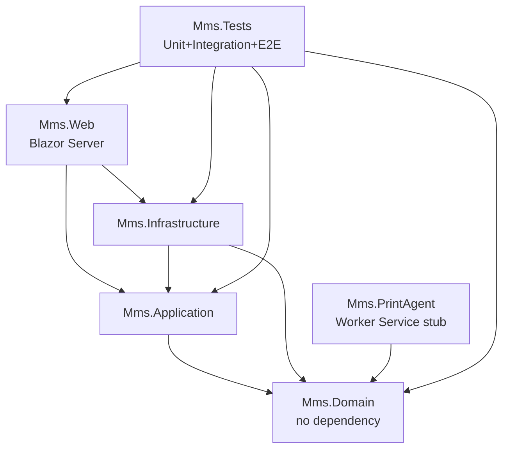

# Phase 00 — Repo + Solution + Docker Compose Setup

## Context Links

- Parent plan: [`./plan.md`](./plan.md)
- Brainstorm: [`../reports/brainstorm-260420-1558-agm-voting-system-architecture.md`](../reports/brainstorm-260420-1558-agm-voting-system-architecture.md) § 3.1, § 3.3
- BRD: N/A (infrastructure phase)
- Dependencies: none (start phase)

## Overview

- **Date**: Tuần 1 (T1-T7 cal days)
- **Priority**: P1 (blocker cho mọi phase sau)
- **Status**: pending
- **Brief**: Khởi tạo Git repo, tạo Solution 6-project Clean Architecture, dựng Docker Compose (blazor-app + postgres:16 + libreoffice stub), smoke test "Hello MMS" page chạy qua container.

## Key Insights

- Clean Architecture 6 project: Domain (no dependency) → Application → Infrastructure → Web + PrintAgent (stub) + Tests. Tuân thủ bất biến: Domain không ref Infrastructure.
- Docker Compose 3 services + named volume `postgres_data` + healthcheck `pg_isready` + `depends_on: condition: service_healthy` — tránh race condition khi app start trước DB ready.
- LibreOffice service chỉ stub ở phase này (Dockerfile base `linuxserver/libreoffice` hoặc `instrumentisto/libreoffice` — confirm sau). Pilot không cần chạy render thực.
- Multi-stage Dockerfile cho blazor-app: `mcr.microsoft.com/dotnet/sdk:8.0` build → `aspnet:8.0` runtime, trim image <250MB.
- `.env.example` commit; `.env` thêm `.gitignore`. KHÔNG commit credentials.

## Requirements

### Functional
- [F-00.1] Git repo init với `.gitignore`, `.editorconfig`, `Directory.Build.props`, `README.md`.
- [F-00.2] Solution `Mms.sln` chứa 6 projects ref đúng chiều phụ thuộc Clean Architecture.
- [F-00.3] `docker-compose up -d` start thành công 3 services trên Windows 10/11 + Docker Desktop.
- [F-00.4] Truy cập `http://localhost:8080` → trang "Hello MMS" (smoke test).
- [F-00.5] `psql -h localhost -p 5432 -U mms` kết nối Postgres thành công từ host.

### Non-Functional
- [NF-00.1] Docker image blazor-app < 300MB.
- [NF-00.2] `docker-compose up -d` cold start < 60s đến khi healthy.
- [NF-00.3] Postgres data persist qua `docker-compose down` (named volume).
- [NF-00.4] Solution build clean (`dotnet build`) không warning ở level `warnaserror` OFF nhưng 0 error.

## Architecture



### Docker Compose Topology

```
host machine (Windows)
  ├─ Docker Desktop
  │   └─ network: mms-net (bridge)
  │       ├─ blazor-app:8080  (expose host:8080)
  │       ├─ postgres:5432    (expose host:5432 debug only)
  │       └─ libreoffice:8100 (stub, not exposed)
  └─ volume: postgres_data (persistent)
```

## Related Code Files

### Create
- `.gitignore` (dotnet + VS + rider + Docker)
- `.editorconfig` (4 space indent, LF, utf-8)
- `.env.example`
- `Directory.Build.props` (LangVersion 12, Nullable enable, TreatWarningsAsErrors false)
- `README.md` (prerequisites, quick start, project structure)
- `Mms.sln`
- `src/Mms.Domain/Mms.Domain.csproj` — netstandard2.1 hoặc net8.0 lib, 0 dependency
- `src/Mms.Application/Mms.Application.csproj` — ref Domain + MediatR + FluentValidation
- `src/Mms.Infrastructure/Mms.Infrastructure.csproj` — ref Application + EF Core + Npgsql + Serilog
- `src/Mms.Web/Mms.Web.csproj` — Blazor Server, ref Application + Infrastructure + MudBlazor
- `src/Mms.Web/Pages/Index.razor` (smoke test "Hello MMS")
- `src/Mms.Web/Program.cs` (minimal bootstrap)
- `src/Mms.Web/appsettings.json` (placeholder)
- `src/Mms.PrintAgent/Mms.PrintAgent.csproj` — Worker Service stub
- `src/Mms.PrintAgent/Program.cs` (just "Print Agent stub started")
- `tests/Mms.UnitTests/Mms.UnitTests.csproj` — xUnit + FluentAssertions
- `tests/Mms.IntegrationTests/Mms.IntegrationTests.csproj` — xUnit + Testcontainers.PostgreSql
- `tests/Mms.E2ETests/Mms.E2ETests.csproj` — Microsoft.Playwright
- `docker-compose.yml`
- `docker/blazor-app.Dockerfile` (multi-stage)
- `docker/libreoffice-stub.Dockerfile`
- `docker/postgres-init.sql` (CREATE EXTENSION if needed — e.g. `uuid-ossp`, `citext`)

### Modify
- none

### Delete
- none

## Implementation Steps

1. **Git init**
   - `git init`; tạo `.gitignore` (template `VisualStudio` + thêm `**/.env`, `**/postgres_data/`, `**/bin`, `**/obj`, `**/.vs`, `**/.idea`).
   - Commit initial: `chore: init repo with gitignore and editorconfig`.

2. **Directory.Build.props**
   - Set `<LangVersion>12</LangVersion>`, `<Nullable>enable</Nullable>`, `<TargetFramework>net8.0</TargetFramework>` default, `<ImplicitUsings>enable</ImplicitUsings>`.
   - Central package management optional (Directory.Packages.props).

3. **Create solution + 6 projects**
   - `dotnet new sln -n Mms`
   - `dotnet new classlib -n Mms.Domain -o src/Mms.Domain`
   - `dotnet new classlib -n Mms.Application -o src/Mms.Application`
   - `dotnet new classlib -n Mms.Infrastructure -o src/Mms.Infrastructure`
   - `dotnet new blazorserver -n Mms.Web -o src/Mms.Web --no-https`
   - `dotnet new worker -n Mms.PrintAgent -o src/Mms.PrintAgent`
   - `dotnet new xunit -n Mms.UnitTests -o tests/Mms.UnitTests`
   - `dotnet new xunit -n Mms.IntegrationTests -o tests/Mms.IntegrationTests`
   - `dotnet new xunit -n Mms.E2ETests -o tests/Mms.E2ETests`
   - `dotnet sln add` tất cả projects.

4. **Set project references (Clean Architecture)**
   - Application → Domain
   - Infrastructure → Application, Domain
   - Web → Application, Infrastructure
   - PrintAgent → Domain (stub chỉ share DTO)
   - Tests → all relevant

5. **Add NuGet packages**
   - Application: `MediatR` (12.x), `FluentValidation` (11.x)
   - Infrastructure: `Microsoft.EntityFrameworkCore` (8.x), `Npgsql.EntityFrameworkCore.PostgreSQL` (8.x), `Microsoft.Extensions.Configuration.Binder`, `Serilog.AspNetCore`, `Serilog.Sinks.PostgreSQL` (confirm package name), `Serilog.Sinks.File`
   - Web: `MudBlazor` (7.x), `Microsoft.AspNetCore.Identity.EntityFrameworkCore`, `Microsoft.AspNetCore.Authentication.JwtBearer`, `Serilog.AspNetCore`
   - PrintAgent: `Microsoft.Extensions.Hosting.WindowsServices`
   - UnitTests: `FluentAssertions`, `Moq` (optional), `Bogus` (optional fake data)
   - IntegrationTests: `Testcontainers.PostgreSql`
   - E2ETests: `Microsoft.Playwright`, `Microsoft.Playwright.NUnit` hoặc xUnit adapter

6. **Smoke test page**
   - Thay `Pages/Index.razor` default thành `<h1>Hello MMS — @DateTime.UtcNow</h1>`.
   - `Program.cs` minimal: `builder.Services.AddRazorPages()`, `builder.Services.AddServerSideBlazor()`, `builder.Services.AddMudServices()`, `app.UseStaticFiles()`, `app.MapBlazorHub()`, `app.MapFallbackToPage("/_Host")`.
   - Verify local: `dotnet run --project src/Mms.Web` → `http://localhost:5000` hiện "Hello MMS".

7. **Dockerfile blazor-app (multi-stage)**
   ```dockerfile
   FROM mcr.microsoft.com/dotnet/sdk:8.0 AS build
   WORKDIR /src
   COPY . .
   RUN dotnet restore Mms.sln
   RUN dotnet publish src/Mms.Web/Mms.Web.csproj -c Release -o /app --no-restore

   FROM mcr.microsoft.com/dotnet/aspnet:8.0 AS runtime
   WORKDIR /app
   COPY --from=build /app .
   ENV ASPNETCORE_URLS=http://+:8080
   EXPOSE 8080
   ENTRYPOINT ["dotnet", "Mms.Web.dll"]
   ```

8. **Dockerfile libreoffice-stub**
   - Base `linuxserver/libreoffice:latest` hoặc `instrumentisto/libreoffice:7`.
   - Expose placeholder port 8100; CMD `sleep infinity` (pilot chưa cần chạy convert).

9. **docker-compose.yml**
   ```yaml
   services:
     postgres:
       image: postgres:16-alpine
       environment:
         POSTGRES_DB: mms
         POSTGRES_USER: ${POSTGRES_USER}
         POSTGRES_PASSWORD: ${POSTGRES_PASSWORD}
       volumes:
         - postgres_data:/var/lib/postgresql/data
         - ./docker/postgres-init.sql:/docker-entrypoint-initdb.d/init.sql
       healthcheck:
         test: ["CMD-SHELL", "pg_isready -U $$POSTGRES_USER -d $$POSTGRES_DB"]
         interval: 5s
         timeout: 5s
         retries: 10
       ports:
         - "5432:5432"
       networks: [mms-net]

     libreoffice:
       build:
         context: .
         dockerfile: docker/libreoffice-stub.Dockerfile
       networks: [mms-net]

     blazor-app:
       build:
         context: .
         dockerfile: docker/blazor-app.Dockerfile
       environment:
         ConnectionStrings__Default: "Host=postgres;Port=5432;Database=mms;Username=${POSTGRES_USER};Password=${POSTGRES_PASSWORD}"
         ASPNETCORE_ENVIRONMENT: Development
       depends_on:
         postgres:
           condition: service_healthy
       ports:
         - "8080:8080"
       networks: [mms-net]

   volumes:
     postgres_data:

   networks:
     mms-net:
       driver: bridge
   ```

10. **.env.example**
    ```
    POSTGRES_USER=mms
    POSTGRES_PASSWORD=changeme_local_only
    JWT_SECRET=replace-with-openssl-rand-base64-32
    JWT_ISSUER=mms-local
    JWT_AUDIENCE=mms-users
    ```

11. **postgres-init.sql**
    ```sql
    CREATE EXTENSION IF NOT EXISTS "uuid-ossp";
    CREATE EXTENSION IF NOT EXISTS citext;
    ```

12. **README.md**
    - Prerequisites: Windows 10/11, Docker Desktop, .NET 8 SDK.
    - Quick start: `cp .env.example .env` → `docker-compose up -d --build` → open `http://localhost:8080`.
    - Project structure tree.
    - Troubleshooting common Docker Desktop WSL2 issues.

13. **Smoke test**
    - `docker-compose down -v && docker-compose up -d --build`
    - `curl http://localhost:8080` → must contain "Hello MMS".
    - `docker exec -it <postgres_container> psql -U mms -d mms -c "\dx"` → lists `uuid-ossp`, `citext`.

14. **Git commits**
    - Atomic commits conventional format: `chore: init solution`, `chore: add docker compose`, `docs: add README quick start`.

## Todo List

- [ ] T00-1: `git init` + `.gitignore` + `.editorconfig` + `Directory.Build.props`
- [ ] T00-2: `dotnet new sln` + 6 projects + refs
- [ ] T00-3: Add NuGet packages theo danh sách step 5
- [ ] T00-4: Smoke page `Hello MMS` + `dotnet run` local verify
- [ ] T00-5: `blazor-app.Dockerfile` multi-stage
- [ ] T00-6: `libreoffice-stub.Dockerfile`
- [ ] T00-7: `docker-compose.yml` + `postgres-init.sql` + `.env.example`
- [ ] T00-8: `README.md` quick start
- [ ] T00-9: `docker-compose up -d --build` verify 3 services healthy
- [ ] T00-10: `curl localhost:8080` + psql connect smoke
- [ ] T00-11: Commit & push baseline

## Success Criteria

- [ ] `dotnet build Mms.sln` → 0 error, 0 warning.
- [ ] `docker-compose up -d --build` → 3 services `Up` + postgres `healthy` trong 60s.
- [ ] `http://localhost:8080` trả về page "Hello MMS".
- [ ] `docker-compose down && docker-compose up -d` → postgres data persist (volume).
- [ ] README clear đến mức dev mới chạy được trong < 15 phút.

## Risk Assessment

| Risk | Impact | Mitigation |
|------|--------|-----------|
| Docker Desktop WSL2 chậm / port conflict 8080/5432 | Medium | README note fallback port; `netstat -ano` check; document WSL2 memory limit `.wslconfig` |
| Antivirus block docker image pull | Low | Docs whitelist `mcr.microsoft.com`, `registry-1.docker.io` |
| Dev không có .NET 8 SDK | Low | README prerequisite + link download |
| LibreOffice image pull lớn (~500MB) | Low | Cache layer; pilot dùng stub sleep infinity giảm size |
| Team chưa từng viết Dockerfile multi-stage | Medium | Tech Lead pair với 2 dev trong step 7-9 |

## Security Considerations

- `.env` trong `.gitignore` (KHÔNG commit).
- Postgres password placeholder — document phải đổi trước production.
- JWT secret random 32 bytes — `openssl rand -base64 32`.
- Docker network `mms-net` bridge; chỉ blazor-app expose port ra host; postgres port 5432 expose chỉ để debug local (production sẽ disable).
- Dockerfile không chạy root: thêm `USER app` (aspnet image có sẵn user `app`).

## Next Steps

- **Dependencies satisfied for**: Phase 01 (cần solution + postgres container sẵn để chạy migration).
- **Next phase**: [phase-01-database-auth-identity](./phase-01-database-auth-identity-ef-migration-seed.md)

## Unresolved Questions

- LibreOffice base image: `linuxserver/libreoffice` (~1.2GB) vs `instrumentisto/libreoffice` (~700MB) vs build from Alpine (~400MB nhưng phức tạp)? Pilot chọn stub, defer đến Phase Template Engine.
- Central Package Management (Directory.Packages.props) có áp dụng không? Recommend có để dễ bump version.
