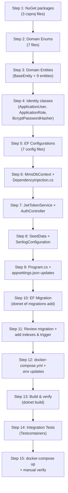

# Phase 01 — Database + Auth/Identity — Implementation Plan

## Background

Phase 00 đã hoàn thành: solution .NET 8 Clean Architecture với 5 src projects (`Domain`, `Application`, `Infrastructure`, `Web`, `PrintAgent`) và 3 test projects. Docker Compose chạy Postgres 16 + Blazor Server (MudBlazor 9.3.0). Các project hiện chỉ có placeholder `Class1.cs`.

Phase 01 sẽ thiết lập toàn bộ nền tảng dữ liệu và xác thực: EF Core DbContext, tất cả entity/table, ASP.NET Core Identity, JWT auth, Serilog logging, seed data.

## User Review Required

> [!IMPORTANT]
> **Unresolved Questions từ phase-01 spec** — cần xác nhận trước khi triển khai:
> 1. **Password policy**: Spec ghi `RequireNonAlphanumeric = false`. Giữ nguyên hay yêu cầu ký tự đặc biệt?
> 2. **Session timeout**: Access token 1h, refresh 8h — hay rút ngắn 4h cho ngày đại hội?
> 3. **Audit log trigger**: Đặt trong EF migration (tự động) hay seed script (thủ công)?
>
> → **Mặc định plan**: giữ spec gốc (`RequireNonAlphanumeric=false`, access 1h/refresh 8h, trigger trong migration).

> [!WARNING]
> **BCrypt password hasher**: Spec yêu cầu BCrypt thay vì PBKDF2 mặc định. Cần cài `BCrypt.Net-Next` và implement custom `IPasswordHasher<ApplicationUser>`. Đây là deviation khỏi ASP.NET Core Identity default — nếu team không strong opinion, có thể giữ PBKDF2 (vẫn secure).
>
> → **Mặc định plan**: Implement BCrypt theo spec.

---

## Proposed Changes

### Tổng quan file changes

| Category | New Files | Modified Files |
|----------|-----------|----------------|
| Domain — Entities | 9 files | 0 |
| Domain — Enums | 7 files | 0 |
| Domain — Common | 1 file | 0 |
| Infrastructure — Persistence | 9 files | 0 |
| Infrastructure — Identity | 4 files | 0 |
| Infrastructure — Logging | 1 file | 0 |
| Infrastructure — DI | 1 file | 0 |
| Web — API | 1 file | 0 |
| Web — Config | 0 | 3 files |
| Docker | 0 | 1 file |
| NuGet (csproj) | 0 | 3 files |
| Tests | 2 files | 1 file |
| Cleanup | 0 | 3 files (delete Class1.cs) |
| **Total** | **~35 files** | **~11 files** |

---

### Component 1: Mms.Domain (Entities + Enums)

Tạo tất cả domain entities và enums. Domain project KHÔNG depend NuGet nào ngoài `net8.0` — pure POCOs.

#### [DELETE] [Class1.cs](file:///d:/PROJECT/Robotia_AGM_Voting/src/Mms.Domain/Class1.cs)
- Xóa placeholder file

#### [NEW] Common/BaseEntity.cs
```csharp
public abstract class BaseEntity
{
    public Guid Id { get; set; } = Guid.NewGuid();
    public DateTime CreatedAt { get; set; } = DateTime.UtcNow;
    public DateTime? UpdatedAt { get; set; }
}
```

#### [NEW] Enums/ (7 files)
| File | Values |
|------|--------|
| `MeetingStatus.cs` | `New, Preparing, CheckIn, InSession, Tallying, Completed` |
| `MeetingType.cs` | `Annual, Extraordinary` |
| `ProxyType.cs` | `PreMeeting, OnSite` |
| `ProxyScope.cs` | `Full, Partial` |
| `BallotStatus.cs` | `Active, Invalidated, Regenerated` |
| `TemplateType.cs` | `Invitation, VotingCard, AttendanceReport, VotingResult, Minutes, ProxyCert` |
| `AuditCategory.cs` | `CheckIn, Proxy, Ballot, Cascade, Print, Report, Auth, System` |

#### [NEW] Entities/ (9 files)

| File | Key Properties | Notes |
|------|----------------|-------|
| `Company.cs` | Name, TaxCode, StockCode, LegalRepName, CharterCapital, TotalSharesIssued, TotalVotingShares | Phase 03 sử dụng |
| `Meeting.cs` | CompanyId FK, Title, MeetingType, Status, MeetingDate, Location, RecordDate, TotalVotingShares | Phase 03 |
| `MeetingResolution.cs` | MeetingId FK, DisplayOrder, Title, Content | Phase 03 |
| `MeetingCandidate.cs` | MeetingId FK, DisplayOrder, FullName, Position(HDQT/BKS), BirthYear | Phase 03 |
| `Shareholder.cs` | MeetingId FK, 16 fields VSDC, VotingRights | Phase 04 skeleton |
| `Proxy.cs` | MeetingId FK, GrantorId FK→Shareholders, Shares, Scope, ProxyType | Phase 05+ skeleton |
| `Ballot.cs` | MeetingId FK, ShareholderId FK, AttendCode, VotingShares, Status, ParentBallotId self-ref, `uint Xmin` concurrency | Phase 05+ |
| `Template.cs` | MeetingId FK, TemplateType, Language, Version, FilePath, FieldsConfig JSONB | Future |
| `AuditLog.cs` | `long Id` (BIGSERIAL, NOT BaseEntity), Ts, UserId, Actor, Category, EntityType, EntityId, MeetingId, Detail(JSONB) | Append-only |

---

### Component 2: Mms.Infrastructure (EF Core + Identity + JWT + Serilog)

#### [MODIFY] [Mms.Infrastructure.csproj](file:///d:/PROJECT/Robotia_AGM_Voting/src/Mms.Infrastructure/Mms.Infrastructure.csproj)
Thêm NuGet packages:
```xml
<PackageReference Include="Microsoft.AspNetCore.Identity.EntityFrameworkCore" Version="8.*" />
<PackageReference Include="Microsoft.AspNetCore.Authentication.JwtBearer" Version="8.*" />
<PackageReference Include="BCrypt.Net-Next" Version="4.*" />
<PackageReference Include="Serilog.Sinks.PostgreSQL" Version="4.*" />
<PackageReference Include="Microsoft.EntityFrameworkCore.Design" Version="8.*">
  <PrivateAssets>all</PrivateAssets>
</PackageReference>
```

#### [DELETE] [Class1.cs](file:///d:/PROJECT/Robotia_AGM_Voting/src/Mms.Infrastructure/Class1.cs)

---

#### Persistence Sub-component

#### [NEW] Persistence/MmsDbContext.cs
- Inherits `IdentityDbContext<ApplicationUser, ApplicationRole, Guid>`
- `DbSet<T>` cho tất cả 9 entities
- `OnModelCreating`: apply tất cả configurations via `modelBuilder.ApplyConfigurationsFromAssembly()`
- **KHÔNG** tạo `DbSet` cho bảng `logs` (Serilog tự quản lý)

#### [NEW] Persistence/Configurations/ (7 files)
| File | Key Configurations |
|------|-------------------|
| `CompanyConfiguration.cs` | `tax_code` UNIQUE index, required fields |
| `MeetingConfiguration.cs` | FK → Company, status string convert, index on `company_id` |
| `MeetingResolutionConfiguration.cs` | FK → Meeting, composite order |
| `MeetingCandidateConfiguration.cs` | FK → Meeting |
| `ShareholderConfiguration.cs` | FK → Meeting, UNIQUE `(meeting_id, id_number)` |
| `BallotConfiguration.cs` | FK → Meeting, FK → Shareholder, self-ref FK, `UseXminAsConcurrencyToken()`, indexes: `(meeting_id, status)`, filtered `(meeting_id, reprint_needed) WHERE reprint_needed` |
| `AuditLogConfiguration.cs` | BIGSERIAL PK (not GUID), JSONB `detail`, index `(meeting_id, ts DESC)`, TODO trigger comment |

> [!NOTE]
> Các entity `Proxy` và `Template` sẽ dùng convention-based mapping (không cần custom Configuration phức tạp ở phase này). Proxy sẽ có Configuration riêng khi implement Phase 05.

#### [NEW] Persistence/SeedData.cs
- `EnsureSeededAsync(IServiceProvider services)`
- Tạo 4 roles: `admin`, `operator`, `viewer`, `checkin`
- Tạo admin user: username từ env `SEED_ADMIN_USERNAME` (default `admin`), password từ env `SEED_ADMIN_PASSWORD` (default `Admin@2026!`)
- Set `MustChangePassword = true`, assign role `admin`
- Idempotent: check `RoleExistsAsync` trước khi seed

---

#### Identity Sub-component

#### [NEW] Identity/ApplicationUser.cs
```csharp
public class ApplicationUser : IdentityUser<Guid>
{
    public string FullName { get; set; } = string.Empty;
    public bool MustChangePassword { get; set; } = true;
    public DateTime? LastLoginAt { get; set; }
}
```

#### [NEW] Identity/ApplicationRole.cs
```csharp
public class ApplicationRole : IdentityRole<Guid>
{
    public string? Description { get; set; }
}
```

#### [NEW] Identity/BcryptPasswordHasher.cs
- Implement `IPasswordHasher<ApplicationUser>`
- `HashPassword`: `BCrypt.Net.BCrypt.HashPassword(password, workFactor: 12)`
- `VerifyHashedPassword`: `BCrypt.Net.BCrypt.Verify()`

#### [NEW] Identity/JwtTokenService.cs
- `GenerateAccessToken(ApplicationUser, IList<string> roles)` → JWT 1h
  - Claims: `sub` (userId), `jti`, `name` (username), `role`, `must_change_password`
- `GenerateRefreshToken()` → 64 random bytes → base64
- JWT signing key từ env `JWT_SECRET` (min 32 chars)
- Issuer/Audience từ config

---

#### Logging Sub-component

#### [NEW] Logging/SerilogConfiguration.cs
- Static method `ConfigureSerilog(IConfiguration config, string connectionString)`
- 3 sinks:
  1. **Console**: structured template `[{Timestamp:HH:mm:ss} {Level:u3}] {Message:lj}{NewLine}{Exception}`
  2. **File**: `logs/mms-.log`, daily rolling, retain 10 files
  3. **PostgreSQL**: table `logs`, `needAutoCreateTable: true`, `failureCallback` swallow errors

---

#### DI Registration

#### [NEW] DependencyInjection.cs
- Extension method `AddInfrastructure(this IServiceCollection, IConfiguration)`
- Register: DbContext, Identity, JwtBearer auth, JwtTokenService, password hasher

---

### Component 3: Mms.Web (API + Startup)

#### [MODIFY] [Mms.Web.csproj](file:///d:/PROJECT/Robotia_AGM_Voting/src/Mms.Web/Mms.Web.csproj)
Thêm packages (move Identity package sang Infrastructure nếu chưa có):
```xml
<PackageReference Include="Microsoft.AspNetCore.Authentication.JwtBearer" Version="8.*" />
```

#### [MODIFY] [Program.cs](file:///d:/PROJECT/Robotia_AGM_Voting/src/Mms.Web/Program.cs)
Thêm theo thứ tự:
1. `builder.Host.UseSerilog()` (Serilog bootstrap)
2. `builder.Services.AddInfrastructure(builder.Configuration)` — gọi DI extension
3. `builder.Services.AddControllers()` — cho API controllers
4. Auto-migrate in Development: `context.Database.Migrate()`
5. `SeedData.EnsureSeededAsync()`
6. `app.UseAuthentication()` + `app.UseAuthorization()`
7. `app.UseSerilogRequestLogging()`
8. `app.MapControllers()`

#### [MODIFY] [appsettings.json](file:///d:/PROJECT/Robotia_AGM_Voting/src/Mms.Web/appsettings.json)
Thêm sections:
```json
{
  "ConnectionStrings": {
    "Default": "Host=localhost;Port=5432;Database=mms;Username=mms;Password=changeme_local_only"
  },
  "Jwt": {
    "Issuer": "mms-local",
    "Audience": "mms-users",
    "AccessTokenExpiryMinutes": 60,
    "RefreshTokenExpiryHours": 8
  },
  "Identity": {
    "Lockout": {
      "MaxFailedAccessAttempts": 5,
      "LockoutDurationMinutes": 15
    }
  }
}
```

> [!IMPORTANT]
> `JWT_SECRET` và `DB_PASSWORD` **KHÔNG** nằm trong appsettings — chỉ đọc từ environment variables.

#### [MODIFY] [appsettings.Development.json](file:///d:/PROJECT/Robotia_AGM_Voting/src/Mms.Web/appsettings.Development.json)
Thêm connection string override cho local dev.

#### [NEW] Api/AuthController.cs
6 endpoints:
| Endpoint | Auth | Description |
|----------|------|-------------|
| `POST /api/auth/login` | Anonymous | PasswordSignIn → JWT + refresh cookie |
| `POST /api/auth/refresh` | Anonymous | Validate refresh cookie → new access token |
| `POST /api/auth/logout` | `[Authorize]` | Clear refresh cookie |
| `POST /api/auth/change-password` | `[Authorize]` | Change password, clear `MustChangePassword` |
| `POST /api/auth/forgot-password` | Anonymous | **Stub**: return 200 OK |
| `POST /api/auth/reset-password` | Anonymous | **Stub**: return 200 OK |

---

### Component 4: Mms.IntegrationTests

#### [MODIFY] [Mms.IntegrationTests.csproj](file:///d:/PROJECT/Robotia_AGM_Voting/tests/Mms.IntegrationTests/Mms.IntegrationTests.csproj)
Thêm project reference tới `Mms.Web` (cần cho `WebApplicationFactory` hoặc service resolution).

#### [NEW] Fixtures/DatabaseFixture.cs
- Testcontainers PostgreSQL container
- Apply migration + seed
- Implement `IAsyncLifetime`

#### [NEW] Tests/Phase01Tests.cs
3 test cases:
1. `Migration_AppliesSuccessfully_AllTablesCreated` — verify all tables exist
2. `IdentitySeeder_Creates4Roles_And1Admin` — verify roles & admin user
3. `JwtService_IssuesValidToken_WithCorrectClaims` — verify JWT claims

#### [DELETE] [UnitTest1.cs](file:///d:/PROJECT/Robotia_AGM_Voting/tests/Mms.IntegrationTests/UnitTest1.cs)
Xóa placeholder.

---

### Component 5: Docker / Migration

#### [MODIFY] [docker-compose.yml](file:///d:/PROJECT/Robotia_AGM_Voting/docker-compose.yml)
Thêm environment variables cho `blazor-app`:
```yaml
JWT_SECRET: ${JWT_SECRET:-replace-with-openssl-rand-base64-32}
SEED_ADMIN_USERNAME: ${SEED_ADMIN_USERNAME:-admin}
SEED_ADMIN_PASSWORD: ${SEED_ADMIN_PASSWORD:-Admin@2026!}
```

---

### Component 6: EF Migration + Audit Trigger

#### [NEW] Persistence/Migrations/ (auto-generated)
- `dotnet ef migrations add InitialCreate` → tạo migration file
- Review → bổ sung thủ công:
  - Index `shareholders(meeting_id, id_number)`
  - Index `audit_logs(meeting_id, ts DESC)`
  - Index `ballots(meeting_id, status)`
  - Filtered index `ballots(meeting_id, reprint_needed) WHERE reprint_needed = true`
  - SQL trigger `audit_log_immutable` prevent UPDATE/DELETE on `audit_logs`

---

## Execution Order



---

## Open Questions

> [!IMPORTANT]
> 1. **BCrypt vs PBKDF2**: Spec yêu cầu BCrypt. Nếu không có strong opinion, recommend giữ BCrypt theo spec. Confirm?
> 2. **Serilog.Sinks.PostgreSQL**: Package `Serilog.Sinks.PostgreSQL` (by b00lduck) vs `Serilog.Sinks.PostgreSQL.Alternative` — recommend dùng bản chính `Serilog.Sinks.PostgreSQL`. OK?
> 3. **Docker Desktop**: Conversation trước ghi nhận Docker daemon chưa chạy. Cần Docker running để test `docker-compose up` ở cuối. Đã fix chưa?

---

## Verification Plan

### Automated Tests
```bash
# 1. Build toàn bộ solution
dotnet build Mms.sln

# 2. Chạy integration tests (cần Docker Desktop running)
dotnet test tests/Mms.IntegrationTests --logger "console;verbosity=detailed"
```

### Manual Verification
```bash
# 3. Docker compose test
docker-compose up -d
# Chờ healthy → verify migration apply

# 4. Test login endpoint
curl -X POST http://localhost:8080/api/auth/login \
  -H "Content-Type: application/json" \
  -d '{"username":"admin","password":"Admin@2026!"}'
# → expect JWT with must_change_password: true

# 5. Verify Serilog
# - Console: structured logs visible in docker logs
# - File: logs/mms-*.log created
# - Postgres: SELECT * FROM logs LIMIT 5;

# 6. Verify audit trigger
# psql → UPDATE audit_logs SET actor='test' WHERE id=1;
# → expect: ERROR: audit_logs is append-only
```
