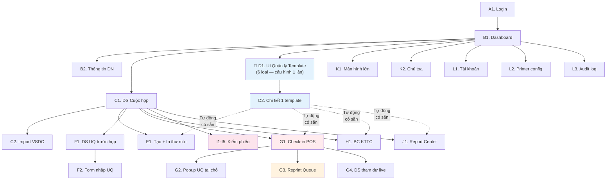

# Đề xuất giao diện hệ thống MMS Web — Chi tiết trường thông tin

> **Dựa trên**: Revised Architect Plan v3 (2026-04-20)
>
> **Tổng cộng**: 30 màn hình, chia theo 8 bước quy trình ĐHCĐ + UI Quản lý Template tập trung + Auth + Admin + Display

---

## Tổng quan các nhóm giao diện

| Nhóm | Số MH | Mô tả |
|------|-------|-------|
| **A. Auth** | 2 | Login, Đổi mật khẩu |
| **B. Bước ①** | 2 | Dashboard chính, Thông tin DN |
| **C. Bước ②** | 2 | DS cuộc họp, Import VSDC |
| **🔵 D. UI Quản lý Template** | **2** | **Tổng quan 6 template + Chi tiết cấu hình từng template** |
| **E. Bước ③** | 1 | Tạo + in thư mời (template đã chốt từ D) |
| **F. Bước ④** | 2 | DS ủy quyền trước họp, Form nhập UQ |
| **G. Bước ⑤** | 4 | Check-in POS, Reprint Queue, DS tham dự live, Popup UQ tại chỗ |
| **H. Bước ⑥** | 1 | BC kiểm tra tư cách + snapshot (template từ D) |
| **I. Bước ⑦** | 5 | Kiểm phiếu 5 loại, Consistency Check, Xác nhận KQ |
| **J. Bước ⑧** | 3 | Report Center, Preview BC, 3 danh sách (template từ D) |
| **K. Display** | 2 | Dashboard màn hình lớn, Dashboard chủ tọa |
| **L. Admin** | 4 | Tài khoản, Cấu hình printer, Audit log |

---

## A. AUTH

### A1. Đăng nhập

```text
┌────────────────────────────────────────┐
│           HỆ THỐNG MMS                 │
│                                         │
│   Tên đăng nhập: [________________]   │
│   Mật khẩu:      [________________]   │
│                                         │
│   ☐ Ghi nhớ đăng nhập   [Quên mật khẩu?]│
│                                         │
│          [ ĐĂNG NHẬP ]                 │
│                                         │
│   Phiên bản: v2.0.0                    │
└────────────────────────────────────────┘
```

| Trường | Kiểu | Bắt buộc | Validation |
|--------|------|----------|------------|
| Tên đăng nhập | Text | ✅ | 3-50 ký tự |
| Mật khẩu | Password | ✅ | Min 8 ký tự |
| Ghi nhớ | Checkbox | — | JWT refresh token |
| Quên mật khẩu | Link | — | Dẫn tới màn hình Phục hồi mật khẩu |

**API**: `POST /api/auth/login`

---

### A2. Quên mật khẩu (Khôi phục)

```text
┌────────────────────────────────────────┐
│          PHỤC HỒI MẬT KHẨU             │
│                                        │
│ Vui lòng nhập Email liên kết với tài   │
│ khoản để nhận đường dẫn đặt lại.       │
│                                        │
│   Email: [________________________]    │
│                                        │
│       [ GỬI LIÊN KẾT PHỤC HỒI ]        │
│                                        │
│         [← Quay lại đăng nhập]         │
└────────────────────────────────────────┘
```

| Trường | Kiểu | Bắt buộc | Ghi chú |
|--------|------|----------|---------|
| Email | Email | ✅ | Validate email Format. Kiểm tra có tồn tại trong hệ thống. |

**API**: `POST /api/auth/forgot-password`, `POST /api/auth/reset-password`

---

### A3. Đổi mật khẩu

| Trường | Kiểu | Bắt buộc |
|--------|------|----------|
| Mật khẩu cũ | Password | ✅ |
| Mật khẩu mới | Password | ✅ |
| Xác nhận mật khẩu mới | Password | ✅ |

**API**: `PUT /api/auth/change-password`

---

## B. BƯỚC ① — THÔNG TIN DOANH NGHIỆP

### B1. Dashboard chính (sau đăng nhập)

```
┌─────────────────────────────────────────────────────────────────────────┐
│  [LOGO] HỆ THỐNG QUẢN LÝ ĐHCĐ              Xin chào, [Tên user] ▼   │
├─────────────────────────────────────────────────────────────────────────┤
│                                                                         │
│  ┌─────────────────┐  ┌─────────────────┐  ┌─────────────────┐        │
│  │ 📋 CUỘC HỌP     │  │ 📊 THỐNG KÊ    │  │ ⚙️ CẤU HÌNH     │        │
│  │ DS cuộc họp      │  │ Tổng CĐ: 1,200 │  │ Thông tin DN    │        │
│  │ [+ Tạo mới]      │  │ Đã họp: 3      │  │ 📋 Template (6) │        │
│  └─────────────────┘  │ Sắp tới: 1     │  │ Tài khoản       │        │
│                        └─────────────────┘  │ Printer         │        │
│  CUỘC HỌP GẦN NHẤT                         └─────────────────┘        │
│  ┌─────────────────────────────────────────────────────────┐           │
│  │ ĐHCĐ thường niên 2026    │ 20/06/2026  │ [Đang chuẩn bị] │           │
│  │ 1,200 CĐ │ 0 đã check-in │ 0% tham dự │ [ Mở → ]        │           │
│  └─────────────────────────────────────────────────────────┘           │
│                                                                         │
│  LỊCH SỬ CUỘC HỌP                                                     │
│  │ Tên │ Ngày │ Tổng CĐ │ Tỷ lệ tham dự │ Trạng thái │              │
│  │─────│──────│─────────│───────────────│────────────│              │
│  │ ... │ ...  │ ...     │ ...           │ Hoàn tất   │              │
└─────────────────────────────────────────────────────────────────────────┘
```

| Thành phần | Dữ liệu |
|------------|---------|
| Thống kê nhanh | Tổng CĐ, Số cuộc họp đã tổ chức, Cuộc họp sắp tới |
| DS cuộc họp gần nhất | Tên, Ngày, Tổng CĐ, Tỷ lệ tham dự, Trạng thái |
| Quick actions | Tạo cuộc họp mới, Mở cuộc họp gần nhất |
| Menu cấu hình | Thông tin DN, **📋 Quản lý Template (6 loại)**, Tài khoản, Printer |

**API**: `GET /api/dashboard`

---

### B2. Thông tin doanh nghiệp

| Trường | Kiểu | Bắt buộc | Ghi chú |
|--------|------|----------|---------|
| Tên công ty | Text | ✅ | Max 200 ký tự |
| Tên viết tắt | Text | ❌ | VD: "TAL", "AST" |
| Số ĐKKD / Mã số thuế | Text | ✅ | 10 hoặc 13 ký tự |
| Địa chỉ trụ sở chính | Textarea | ✅ | |
| Số điện thoại | Text | ✅ | Format: 0xxx-xxx-xxxx |
| Email | Email | ❌ | Validate @ |
| Fax | Text | ❌ | |
| Website | URL | ❌ | |
| Người đại diện pháp luật | Text | ✅ | |
| Chức vụ người đại diện | Text | ✅ | VD: "Chủ tịch HĐQT" |
| Vốn điều lệ (VND) | Number | ✅ | Format: #,###,### |
| Tổng số CP đã phát hành | Number | ✅ | |
| Tổng CP có quyền biểu quyết | Number | ✅ | Có thể ≠ phát hành (CP quỹ) |
| Logo công ty | Image upload | ❌ | PNG/JPG, max 2MB, 200×200px |
| Mã CK | Text | ❌ | VD: "TAL", "AST" |

**Nút hành động**: `[Lưu]` `[Hủy]`
**API**: `GET/PUT /api/companies/{id}`

---

## C. BƯỚC ② — QUẢN LÝ CUỘC HỌP + IMPORT VSDC

### C1. Danh sách cuộc họp

```
┌─────────────────────────────────────────────────────────────────┐
│  QUẢN LÝ CUỘC HỌP                              [+ Tạo mới]   │
├─────────────────────────────────────────────────────────────────┤
│  Bộ lọc: [Năm ▼] [Trạng thái ▼] [🔍 Tìm kiếm...]            │
│                                                                  │
│  │ # │ Tên cuộc họp          │ Ngày     │ Tổng CĐ │ TT      │ │
│  │───│──────────────────────│─────────│────────│────────│ │
│  │ 1 │ ĐHCĐ TN 2026         │ 20/06/26│ 1,200  │ 🟡 CB  │ │
│  │ 2 │ ĐHCĐ BT 2025         │ 15/03/25│ 980    │ 🟢 HT  │ │
│  │                                                               │
│  │ [Mở] [Sửa] [Xóa] [Nhân bản]                                │
└─────────────────────────────────────────────────────────────────┘
```

**Trạng thái cuộc họp**: `Mới tạo` → `Đang chuẩn bị` → `Check-in` → `Đang họp` → `Kiểm phiếu` → `Hoàn tất`

#### Form Tạo / Sửa cuộc họp

| Trường | Kiểu | Bắt buộc | Ghi chú |
|--------|------|----------|---------|
| Tên cuộc họp | Text | ✅ | VD: "Đại hội đồng cổ đông thường niên năm 2026" |
| Loại | Dropdown | ✅ | Thường niên / Bất thường |
| Ngày họp | Date | ✅ | |
| Giờ bắt đầu | Time | ✅ | VD: 08:30 |
| Địa điểm | Text | ✅ | |
| Ngày chốt DS cổ đông | Date | ✅ | Ngày VSDC chốt DS |
| Tổng CP có quyền biểu quyết tại ngày chốt | Number | ✅ | Tự fill từ Thông tin DN, cho phép sửa |
| Chủ tọa | Text | ❌ | |
| Thư ký | Text | ❌ | |
| **Grid: Tờ trình biểu quyết** | Table | ❌ | Các nội dung chi tiết in trên Phiếu BQ |
| **Grid: DS ứng viên bầu cử** | Table | ❌ | Danh sách ứng viên in trên Phiếu bầu |
| Ghi chú | Textarea | ❌ | |

**Nút hành động**: `[Lưu]` `[Hủy]`
**API**: `GET/POST/PUT/DELETE /api/meetings`

---

### C2. Import danh sách cổ đông VSDC (Wizard 4 bước)

#### Bước 1/4 — Upload file

```
┌─────────────────────────────────────────────────────────────────┐
│  IMPORT DANH SÁCH CỔ ĐÔNG TỪ VSDC       Bước 1/4: Upload     │
├─────────────────────────────────────────────────────────────────┤
│                                                                  │
│  Cuộc họp: [ĐHCĐ TN 2026 ▼]                                    │
│                                                                  │
│  ┌──────────────────────────────────────────────┐               │
│  │                                                │               │
│  │    📁 Kéo thả file Excel/CSV vào đây          │               │
│  │    hoặc [Chọn file]                            │               │
│  │                                                │               │
│  │    Hỗ trợ: .xlsx, .xls, .csv                  │               │
│  │    Max: 10MB                                   │               │
│  └──────────────────────────────────────────────┘               │
│                                                                  │
│  ⓘ Lần import trước: 15/05/2026 — 1,200 CĐ                    │
│  ⚠️ Import lần sau sẽ BỔ SUNG, không xóa dữ liệu cũ           │
│                                                                  │
│                              [Tiếp theo →]                      │
└─────────────────────────────────────────────────────────────────┘
```

#### Bước 2/4 — Map cột chuẩn hoá (Giữ đúng trật tự 16 cột VSDC)

> **LƯU Ý NGHIỆP VỤ:** Để đảm bảo tính nguyên vẹn, thuật toán Import phải giữ nguyên **đúng trật tự 16 cột** dữ liệu từ cấu trúc chuẩn của file VSDC (bao gồm cả các cột merge header lồng nhau từ Cột 11 đến 16).

| TT (VSDC) | Tên cột (VSDC Headers) | Map tới trường hệ thống (MMS) | Y/c |
|-----------|----------------------------------------|---------------------------------------|-----|
| 1 | **STT** | STT Nạp | ❌ |
| 2 | **Họ và tên** | Họ tên cổ đông | ✅ |
| 3 | **Mã định danh NĐT (SID)** | SID (Lưu thêm nếu cần) | ❌ |
| 4 | **Mã nhà đầu tư (Investor code)** | Investor Code | ❌ |
| 5 | **Số ĐKSH** | CMND / CCCD / HC / Mã ĐKKD | ✅ |
| 6 | **Ngày cấp** | Ngày cấp chứng thực | ❌ |
| 7 | **Địa chỉ** | Địa chỉ liên hệ | ❌ |
| 8 | **Email** | Email liên lạc | ❌ |
| 9 | **Điện thoại** | Số điện thoại | ❌ |
| 10 | **Quốc tịch** | Quốc tịch (Bắt buộc cho Đa ngôn ngữ) | ✅ |
| 11 | **SL CP nắm giữ (Chưa lưu ký)** | Khối lượng tham khảo | ❌ |
| 12 | **SL CP nắm giữ (Lưu ký)** | Khối lượng tham khảo | ❌ |
| 13 | **SL CP nắm giữ (Tổng cộng)** | Khối lượng tham khảo | ❌ |
| 14 | **SL Quyền phân bổ (Chưa lưu ký)**| Khối lượng quyền tham khảo | ❌ |
| 15 | **SL Quyền phân bổ (Lưu ký)** | Khối lượng quyền tham khảo | ❌ |
| 16 | **SL Quyền phân bổ (Tổng cộng)** | **Số CP có quyền biểu quyết** | ✅ |

#### Bước 3/4 — Preview + Validate

```
┌─────────────────────────────────────────────────────────────────┐
│  IMPORT VSDC — Bước 3/4: Kiểm tra dữ liệu                     │
├─────────────────────────────────────────────────────────────────┤
│                                                                  │
│  ✅ 1,195 dòng hợp lệ    ❌ 5 dòng lỗi    ⚠️ 3 dòng cảnh báo │
│                                                                  │
│  [☐ Chỉ hiện lỗi]  [☐ Chỉ hiện cảnh báo]                     │
│                                                                  │
│  │ # │ CMND        │ Họ tên       │ CP      │ Trạng thái   │   │
│  │───│────────────│─────────────│────────│─────────────│   │
│  │ 1 │ 01234567.. │ Nguyễn Văn A │ 15,000  │ ✅ OK        │   │
│  │ 2 │            │ Trần Thị B   │ 5,000   │ ❌ Thiếu CMND│   │
│  │ 3 │ 09876543.. │ Lê Văn C     │ 10,000  │ ⚠️ Trùng CMND│   │
│  │ ...                                                          │
│                                                                  │
│  Tổng CP import: 150,000,000 / VĐL: 200,000,000 (75%)         │
│                                                                  │
│  [← Quay lại]                        [Import 1,195 dòng →]    │
└─────────────────────────────────────────────────────────────────┘
```

**Các loại lỗi validate**:
- ❌ Thiếu CMND
- ❌ Thiếu tên
- ❌ Số CP ≤ 0
- ⚠️ Trùng CMND (đã có trong hệ thống — cập nhật?)
- ⚠️ Tổng CP vượt VĐL

#### Bước 4/4 — Kết quả

| Thông tin | Giá trị |
|-----------|---------|
| Tổng dòng đọc | 1,200 |
| Import thành công | 1,195 |
| Bỏ qua (lỗi) | 5 |
| CĐ mới thêm | 1,150 |
| CĐ cập nhật | 45 |
| Tổng CP | 150,000,000 |

**API**: `POST /api/meetings/{id}/shareholders/import`

---

## D. 🔵 UI QUẢN LÝ TEMPLATE TẬP TRUNG (Module riêng biệt)

> [!CAUTION]
> **Đây là module RIÊNG BIỆT** — quản lý TẤT CẢ template in ấn. Nguyên tắc:
> 1. **Cấu hình 1 lần ở đây**: Upload template + chọn fields + preview + chốt
> 2. **Tự động có sẵn** trong các bước quy trình (③⑤⑥⑦⑧) — **không cần cài đặt lại**
> 3. **Mọi chỉnh sửa → quay lại UI này** — các bước quy trình chỉ gọi lệnh In

### D1. Tổng quan Template (Dashboard 6 loại)

```
┌──────────────────────────────────────────────────────────────────────────┐
│  📋 QUẢN LÝ TEMPLATE IN ẤN                   [Cuộc họp: ĐHCĐ 2026 ▼] │
├──────────────────────────────────────────────────────────────────────────┤
│                                                                          │
│  ┌──────────────┐ ┌──────────────┐ ┌──────────────┐ ┌──────────────┐    │
│  │ 📄 Thư mời   │ │ 🎫 Thẻ BQ   │ │ 📝 Phiếu BQ  │ │ 🗳️ Phiếu bầu│    │
│  │ ✅ Đã chốt   │ │ ✅ Đã chốt   │ │ ⚠️ Chưa chốt │ │ ✅ Đã chốt   │    │
│  │ v2 20/04/26  │ │ v1 18/04/26  │ │ draft        │ │ v1 19/04/26  │    │
│  │ 6/6 fields   │ │ 7/7 fields   │ │ 0 fields     │ │ 5/6 fields   │    │
│  │ [Mở →]       │ │ [Mở →]       │ │ [Mở →]       │ │ [Mở →]       │    │
│  └──────────────┘ └──────────────┘ └──────────────┘ └──────────────┘    │
│  ┌──────────────┐ ┌──────────────┐                                      │
│  │ 📊 BB KTTC   │ │ 📊 BB Kiểm   │                                      │
│  │    CĐ        │ │    phiếu     │                                      │
│  │ ✅ Đã chốt   │ │ ⚠️ Chưa chốt │                                      │
│  │ v1 18/04/26  │ │ chưa upload  │                                      │
│  │ 10/10 fields │ │ —            │                                      │
│  │ [Mở →]       │ │ [Mở →]       │                                      │
│  └──────────────┘ └──────────────┘                                      │
│                                                                          │
│  Trạng thái tổng: 4/6 template đã chốt ✅                              │
│  ⚠️ Còn 2 template chưa sẵn sàng: Phiếu BQ, BB Kiểm phiếu             │
└──────────────────────────────────────────────────────────────────────────┘
```

**Trường thông tin mỗi card**:

| Trường | Kiểu | Ghi chú |
|--------|------|---------|
| Tên loại template | Text | 6 loại cố định |
| Trạng thái | Badge | ✅ Đã chốt / ⚠️ Chưa chốt / ❌ Chưa upload |
| Phiên bản hiện tại | Text | vN + ngày upload |
| Số fields đã chọn / tổng | Text | VD: "6/8 fields" |
| Bước sử dụng | Badge | ③ / ⑤ / ⑥ / ⑦ |

**API**: `GET /api/meetings/{id}/templates`

---

### D2. Chi tiết cấu hình 1 template

```
┌──────────────────────────────────────────────────────────────────────────┐
│  📋 CẤU HÌNH TEMPLATE: [🎫 Thẻ Biểu Quyết]         [← Quay lại DS]   │
│  Cuộc họp: ĐHCĐ TN 2026         Bước sử dụng: ⑤ Check-in              │
├──────────────────────────────────────────────────────────────────────────┤
│                                                                          │
│  ┌─ Upload Template ─────────┐  ┌─ Chọn Fields hiển thị ────────────┐  │
│  │ Ngôn ngữ: [Tiếng Việt ▼]   │  │                                    │  │
│  │ (Ấn + để thêm bản Eng/Dual)│  │ ☑ Mã tham dự ({{ma_tham_du}})     │  │
│  │ File hiện tại:             │  │ ☑ Mã cổ đông ({{ma_co_dong}})     │  │
│  │ the_bq_2026_v2.docx       │  │ ☑ Họ tên CĐ ({{ho_ten}})         │  │
│  │ Upload: 20/04/2026 09:15  │  │ ☑ Số CP sở hữu ({{so_cp_so_huu}})│  │
│  │ Size: 45KB                 │  │ ☑ Số CP ủy quyền                  │  │
│  │                            │  │    ({{so_cp_uy_quyen}})           │  │
│  │                            │  │ ☑ Tổng số CP ({{tong_so_cp}})     │  │
│  │ Lịch sử phiên bản:        │  │ ☑ Tổng phiếu BQ                   │  │
│  │ • v2 (đang dùng) ✅       │  │    ({{tong_so_phieu_bq}})         │  │
│  │ • v1 (18/04/2026)  [↩]    │  │ ☑ Barcode ({{barcode}})           │  │
│  └────────────────────────────┘  └────────────────────────────────────┘  │
│                                                                          │
│  ┌─ Preview ────────────────────────────────────────────────────────┐   │
│  │                                                                    │   │
│  │  ┌──────────────────────────────────────────────────────────┐    │   │
│  │  │            THẺ BIỂU QUYẾT                                │    │   │
│  │  │  Mã: CD001          Họ tên: Nguyễn Văn A                 │    │   │
│  │  │  CP sở hữu: 15,000  CP ủy quyền: 5,000                  │    │   │
│  │  │  Tổng CP: 20,000    Tổng phiếu BQ: 20,000               │    │   │
│  │  │  ||||||||||||||||| (barcode)                              │    │   │
│  │  └──────────────────────────────────────────────────────────┘    │   │
│  │                                                                    │   │
│  │  CĐ mẫu: [Nguyễn Văn A ▼]  (chọn CĐ khác để preview)           │   │
│  │  [🔄 Refresh preview]                                              │   │
│  └────────────────────────────────────────────────────────────────────┘   │
│                                                                          │
│  ┌─ Cấu hình per-cuộc họp (nếu có) ─────────────────────────────────┐  │
│  │ (Chỉ hiện cho Phiếu BQ và Phiếu bầu cử)                          │  │
│  │                                                                    │  │
│  │ DS nội dung BQ:          [Lấy từ cấu hình NQ ▼] [Xem trước]     │  │
│  │ DS ứng viên bầu cử:     [Lấy từ DS ứng viên ▼] [Xem trước]      │  │
│  └────────────────────────────────────────────────────────────────────┘  │
│                                                                          │
│  [💾 Lưu nháp]    [✅ Chốt template]    [🔄 Bỏ chốt — cho phép sửa]    │
└──────────────────────────────────────────────────────────────────────────┘
```

**Trường thông tin chi tiết**:

| Vùng | Trường | Kiểu | Ghi chú |
|------|--------|------|---------|
| **Upload** | File template (.docx) | File upload | Max 10MB, chỉ .docx |
| | Phiên bản hiện tại | Text (auto) | Auto-increment |
| | Lịch sử upload | List | Tên file, ngày, user upload |
| | Nút rollback | Button | Quay lại phiên bản trước |
| **Fields** | Danh sách fields | Checkbox list | Khác nhau cho mỗi loại template |
| | Tên placeholder | Text | VD: `{{ma_co_dong}}` |
| | Mô tả | Text | VD: "Mã cổ đông / Mã tham dự" |
| | Đã chọn | Boolean | User tick / untick |
| **Preview** | Phiếu mẫu rendered | Embedded doc | Render realtime khi thay đổi |
| | CĐ mẫu | Dropdown | Chọn CĐ để preview data thật |
| **Per-cuộc họp** | DS nội dung BQ | Reference | Chỉ hiện cho Phiếu BQ (loại 3) |
| | DS ứng viên | Reference | Chỉ hiện cho Phiếu bầu (loại 4) |
| **Hành động** | Lưu nháp | Button | Lưu cấu hình chưa chốt |
| | Chốt template | Button | Lock → tự động có sẵn ở bước quy trình |
| | Bỏ chốt | Button | Unlock → cho phép sửa lại |

#### Dynamic fields cho từng loại template

**Loại 1 — Thư mời** (Per-CĐ):

| Field | Placeholder | Mô tả |
|-------|-------------|-------|
| Họ tên | `{{ho_ten}}` | Họ tên cổ đông |
| Địa chỉ | `{{dia_chi}}` | Địa chỉ |
| Số điện thoại | `{{so_dien_thoai}}` | SĐT |
| Số ĐKSH | `{{so_dksh}}` | Số ĐKSH |
| Số CP sở hữu | `{{so_cp_so_huu}}` | Số CP sở hữu |
| QR code | `{{qr_code}}` | QR code (mã CĐ / CMND) |
| Tên công ty | `{{ten_cong_ty}}` | Tên TCPH |
| Ngày họp | `{{ngay_hop}}` | Ngày tổ chức |
| Giờ họp | `{{gio_hop}}` | Giờ bắt đầu |
| Địa điểm | `{{dia_diem_hop}}` | Địa điểm tổ chức |
| STT | `{{stt}}` | Thứ tự trong VSDC |

**Loại 2 — Thẻ biểu quyết** (Per-CĐ):

| Field | Placeholder | Mô tả |
|-------|-------------|-------|
| Mã cổ đông | `{{ma_co_dong}}` | Mã tham dự |
| Họ tên | `{{ho_ten}}` | CĐ / Người đại diện UQ |
| CP sở hữu | `{{so_cp_so_huu}}` | Số CP sở hữu |
| CP ủy quyền | `{{so_cp_uy_quyen}}` | Số CP được ủy quyền |
| Tổng CP | `{{tong_so_cp}}` | CP sở hữu + UQ |
| Tổng phiếu BQ | `{{tong_so_phieu_bq}}` | Tổng phiếu biểu quyết |
| Barcode | `{{barcode}}` | Barcode mã CĐ |

**Loại 3 — Phiếu biểu quyết** (Per-CĐ + Per-cuộc họp):

| Field | Placeholder | Loại |
|-------|-------------|------|
| Mã cổ đông | `{{ma_co_dong}}` | Per-CĐ |
| Họ tên | `{{ho_ten}}` | Per-CĐ |
| CP sở hữu + UQ | `{{so_cp_so_huu_va_uy_quyen}}` | Per-CĐ |
| Tổng phiếu BQ | `{{tong_so_phieu_bq}}` | Per-CĐ |
| Barcode | `{{barcode}}` | Per-CĐ |
| **DS nội dung BQ** | `{{ds_noi_dung_bieu_quyet}}` | **Per-cuộc họp** — Bảng NQ + 3 cột checkbox |

**Loại 4 — Phiếu bầu cử** (Per-CĐ + Per-cuộc họp):

| Field | Placeholder | Loại |
|-------|-------------|------|
| Mã cổ đông | `{{ma_co_dong}}` | Per-CĐ |
| Họ tên | `{{ho_ten}}` | Per-CĐ |
| Số CMND | `{{so_cmnd}}` | Per-CĐ |
| CP sở hữu/đại diện | `{{so_cp_so_huu_dai_dien}}` | Per-CĐ |
| Tổng phiếu bầu | `{{tong_so_phieu_bau}}` | Per-CĐ |
| **DS ứng viên** | `{{ds_ung_vien}}` | **Per-cuộc họp** — Bảng ứng viên + cột bầu |
| Số TV được bầu | `{{so_tv_duoc_bau}}` | Per-cuộc họp |

**Loại 5 — BB kiểm tra tư cách CĐ** (Aggregate):

| Field | Placeholder |
|-------|-------------|
| Tổng CĐ VSDC | `{{tong_so_cd_vsdc}}` |
| Tổng CP VSDC | `{{tong_cp_vsdc}}` |
| CĐ trực tiếp | `{{so_cd_tham_du_truc_tiep}}` |
| CĐ ủy quyền | `{{so_cd_uy_quyen}}` |
| Tổng CĐ tham dự | `{{tong_cd_tham_du}}` |
| Tổng CP tham dự | `{{tong_cp_tham_du}}` |
| Tỷ lệ tham dự | `{{ty_le_tham_du}}` |
| Kết luận | `{{ket_luan}}` |
| Thời gian lập | `{{thoi_gian_lap}}` |
| DS Ban kiểm tra | `{{ds_ban_kiem_tra}}` |

**Loại 6 — BB kiểm phiếu** (Aggregate):

| Field | Placeholder |
|-------|-------------|
| Tên phiếu | `{{ten_phieu}}` |
| Tổng phiếu phát | `{{tong_phieu_phat_ra}}` |
| Tổng phiếu thu | `{{tong_phieu_thu_ve}}` |
| Phiếu hợp lệ | `{{phieu_hop_le}}` |
| Phiếu không hợp lệ | `{{phieu_khong_hop_le}}` |
| Tán thành (số + %) | `{{so_tan_thanh}}`, `{{ty_le_tan_thanh}}` |
| Không tán thành (số + %) | `{{so_khong_tan_thanh}}`, `{{ty_le_khong_tan_thanh}}` |
| Không ý kiến (số + %) | `{{so_khong_y_kien}}`, `{{ty_le_khong_y_kien}}` |
| Kết quả | `{{ket_qua}}` |
| DS ban kiểm phiếu | `{{ds_ban_kiem_phieu}}` |
| Thời gian kiểm | `{{thoi_gian_kiem_phieu}}` |

**API**: 
- `POST /api/meetings/{id}/templates/{type}/upload`
- `PUT /api/meetings/{id}/templates/{type}/fields`
- `GET /api/meetings/{id}/templates/{type}/preview`
- `POST /api/meetings/{id}/templates/{type}/finalize`
- `POST /api/meetings/{id}/templates/{type}/unfinalize`

---

## E. BƯỚC ③ — TẠO + IN THƯ MỜI

> **Template đã được cấu hình sẵn tại [D. UI Quản lý Template]** — bước này chỉ merge data + in.

### E1. Tạo + In thư mời

```
┌─────────────────────────────────────────────────────────────────┐
│  TẠO THƯ MỜI — ĐHCĐ TN 2026        Template: ✅ Đã chốt (v2) │
├─────────────────────────────────────────────────────────────────┤
│                                                                  │
│  Phạm vi:                                                        │
│     ○ Tất cả CĐ (1,200)                                        │
│     ○ CĐ chưa được tạo thư mời (350)                           │
│     ○ Tùy chọn: từ STT [___] đến STT [___]                     │
│     ○ Lọc theo: [Số CP tối thiểu ≥ ___]                        │
│                                                                  │
│  [Xem trước mẫu]    [📋 Sửa template → UI Quản lý Template]    │
│                                                                  │
│  ┌──────────────────────────────────────────────┐               │
│  │ Preview thư mời (CĐ đầu tiên)               │               │
│  │ ┌────────────────────────────────────────┐   │               │
│  │ │  Thư mời CĐ tham dự ĐHCĐ TN 2026     │   │               │
│  │ │  Kính gửi: Ông/Bà Nguyễn Văn A        │   │               │
│  │ │  ĐKSH: 012C345678                      │   │               │
│  │ │  CP sở hữu: 15,000                    │   │               │
│  │ │  [QR CODE]                             │   │               │
│  │ └────────────────────────────────────────┘   │               │
│  └──────────────────────────────────────────────┘               │
│                                                                  │
│  Theo dõi gửi thư:                                               │
│  │ STT │ Họ tên    │ CMND   │ Đã tạo │ Đã in │ Đã gửi │ Trả lại│
│  │─────│──────────│───────│───────│──────│──────│───────│
│  │ 1   │Nguyễn A  │012... │ ✅    │ ✅   │ ✅   │ ❌     │
│  │ 2   │Trần B    │098... │ ✅    │ ❌   │ ❌   │ —      │
│                                                                  │
│  [Tạo thư mời (850)]  [In tất cả]  [Xuất PDF]  [Xuất Word]   │
└─────────────────────────────────────────────────────────────────┘
```

**Bảng theo dõi thư mời — các trường**:

| Cột | Kiểu | Ghi chú |
|-----|------|---------|
| STT | Number | Thứ tự trên VSDC |
| Họ tên | Text | |
| CMND | Text | |
| Số CP | Number | |
| Đã tạo thư mời | Boolean | |
| Đã in | Boolean + DateTime | Thời gian in |
| Đã gửi | Boolean + DateTime | Đánh dấu gửi |
| Trả lại | Boolean | Bưu điện trả lại |
| Ghi chú | Text | |

> **Lưu ý**: Không có phần "chọn fields" hay "upload template" ở đây — đã tách sang UI Quản lý Template (D).
> Nút "Sửa template" link sang D2 nếu cần điều chỉnh.

**API**: `POST /api/meetings/{id}/invitations/generate`, `POST /api/meetings/{id}/invitations/print`

---

## F. BƯỚC ④ — ỦY QUYỀN TRƯỚC NGÀY HỌP

### F1. Danh sách ủy quyền trước họp

```
┌─────────────────────────────────────────────────────────────────┐
│  ỦY QUYỀN TRƯỚC NGÀY HỌP — ĐHCĐ TN 2026      [+ Thêm UQ]    │
├─────────────────────────────────────────────────────────────────┤
│  🔍 Tìm: [______________] theo [CMND ▼]                        │
│                                                                  │
│  Tổng: 45 ủy quyền │ 38 CĐ ủy quyền │ 12 người nhận UQ       │
│  Tổng CP ủy quyền: 2,500,000 / 150,000,000 (1.67%)            │
│                                                                  │
│  │ # │ CĐ ủy quyền  │ CMND CĐ  │ CP UQ    │ Người nhận │ CMND NQ │ Ngày UQ  │    │
│  │───│──────────────│─────────│─────────│───────────│────────│─────────│    │
│  │ 1 │ Nguyễn Văn A │ 012345..│ 15,000  │ Trần B    │ 098765 │ 10/06/26│    │
│  │ 2 │ Lê Thị C     │ 056789..│ 5,000   │ Trần B    │ 098765 │ 12/06/26│    │
│  │                                                                        │
│  │ [Sửa] [Xóa] [Xem scan UQ]                                            │
└─────────────────────────────────────────────────────────────────┘
```

**API**: `GET /api/meetings/{id}/proxies?type=pre-meeting`

---

### F2. Form nhập ủy quyền

```
┌─────────────────────────────────────────────────────────────────┐
│  NHẬP ỦY QUYỀN                                                  │
├────────────────────────────┬────────────────────────────────────┤
│  NGƯỜI ỦY QUYỀN (CĐ)     │  NGƯỜI NHẬN ỦY QUYỀN              │
│                             │                                    │
│  🔍 CMND: [__________]    │  CMND: [______________]            │
│  → Auto load ↓             │  Họ tên: [______________]          │
│  Họ tên: Nguyễn Văn A      │  Ngày cấp: [__/__/____]           │
│  ĐKSH: 012C345678          │  Nơi cấp: [______________]        │
│  CP sở hữu: 15,000         │  Địa chỉ: [______________]        │
│  CP còn lại: 15,000        │  SĐT: [______________]            │
│                             │  Email: [______________]           │
├────────────────────────────┴────────────────────────────────────┤
│  THÔNG TIN ỦY QUYỀN                                             │
│                                                                  │
│  Số CP ủy quyền: [________]   (≤ 15,000 CP còn lại)           │
│  Ngày ủy quyền: [__/__/____]                                   │
│  Nội dung UQ: ○ Toàn bộ quyền  ○ Một phần (ghi rõ)           │
│  Ghi chú: [_________________________________]                   │
│                                                                  │
│  Scan giấy UQ: [📎 Chọn file] hoặc [📸 Chụp ảnh]              │
│  ┌────────────────────────┐                                     │
│  │  Preview scan UQ       │                                     │
│  └────────────────────────┘                                     │
│                                                                  │
│  [Lưu ủy quyền]  [Lưu & Thêm tiếp]  [Hủy]                   │
└─────────────────────────────────────────────────────────────────┘
```

**Trường thông tin chi tiết**:

| Nhóm | Trường | Kiểu | Bắt buộc | Validation |
|------|--------|------|----------|------------|
| **CĐ ủy quyền** | CMND/CCCD | Text | ✅ | 9 hoặc 12 ký tự, phải có trong DS VSDC |
| | Họ tên | Text (auto) | — | Auto-fill từ VSDC |
| | Số ĐKSH | Text (auto) | — | Auto-fill |
| | CP sở hữu | Number (auto) | — | Auto-fill |
| | CP còn lại (chưa UQ) | Number (auto) | — | = Sở hữu - đã UQ cho người khác |
| **Người nhận** | CMND/CCCD | Text | ✅ | 9 hoặc 12 ký tự |
| | Họ tên | Text | ✅ | |
| | Ngày cấp CMND | Date | ❌ | |
| | Nơi cấp | Text | ❌ | |
| | Địa chỉ | Text | ❌ | |
| | Số điện thoại | Text | ❌ | |
| | Email | Email | ❌ | |
| **Ủy quyền** | Số CP ủy quyền | Number | ✅ | > 0, ≤ CP còn lại |
| | Ngày ủy quyền | Date | ✅ | ≤ ngày họp |
| | Nội dung | Radio | ✅ | Toàn bộ / Một phần |
| | Chi tiết (nếu 1 phần) | Textarea | Cond. | Khi chọn "Một phần" |
| | Ghi chú | Text | ❌ | |
| | Scan giấy UQ | File/Image | ❌ | JPG/PNG/PDF, max 5MB |

**API**: `POST /api/meetings/{id}/proxies`

---

## G. BƯỚC ⑤ — CHECK-IN + UQ TẠI CHỖ + IN PHIẾU

### G1. Màn hình Check-in (POS Layout) — MÀN HÌNH CHÍNH

> **Template cho Thẻ BQ / Phiếu BQ / Phiếu bầu (loại 2/3/4) đã chốt sẵn** tại [D. UI Quản lý Template]. Staff chỉ bấm In.

> 🔴 **Đây là màn hình quan trọng nhất** — thiết kế cho tốc độ tối đa, keyboard-first.

```
┌─────────────────────────────────────────────────────────────────────────────┐
│  [LOGO]  ĐHCĐ TN 2026 — CÔNG TY XYZ          Tỷ lệ: 67.23% 🟢 (≥ 50%)  │
│  Bàn ĐK: #3 / 10  │  CĐ tham dự: 456/1,200  │  CP: 100,500,000          │
│  ⚠️ Reprint: 2 người [Xem]                    │  🕐 10:25 AM              │
├─────────────────────────────────────────────────────────────────────────────┤
│  ┌───────────────────────────────────────────────────────────────────────┐ │
│  │  🔍 CMND / Quét QR / Quét CCCD:  [________________________________] │ │
│  └───────────────────────────────────────────────────────────────────────┘ │
├──────────────────────────────────┬──────────────────────────────────────────┤
│  THÔNG TIN CỔ ĐÔNG              │  ỦY QUYỀN                               │
│                                   │                                          │
│  Trạng thái: [🟢 Chưa check-in] │  DS ủy quyền của CĐ này:               │
│  Mã tham dự (Auto): (Chưa cấp)   │  │ # │ Người nhận │ CP UQ  │ Loại │    │
│  Họ tên:     Nguyễn Văn A        │  │───│───────────│───────│──────│    │
│  CMND:       012345678901        │  │ 1 │ Trần B     │ 5,000 │ Trước│    │
│  Địa chỉ:   123 Nguyễn Huệ     │  │                                     │
│  SĐT:       0901234567          │  [+ Thêm UQ tại chỗ]                   │
│  Số ĐKSH:   012C345678          │  [Xóa UQ] (F3)                         │
│  CP sở hữu: 15,000              ├──────────────────────────────────────────┤
│  CP đã UQ:  5,000               │  HÀNH ĐỘNG                              │
│  CP còn lại: 10,000             │                                          │
│                                   │  SL CP tham dự: [10,000______]         │
│  Hình thức tham dự:              │  (= CP còn lại + CP nhận UQ)           │
│  ☑ Trực tiếp (Checkbox)          │                                          │
│  ☑ Nhận ủy quyền (Checkbox)      │  ┌────────────────────────────────┐    │
│  DS CP nhận UQ:                  │  │  ✅ XÁC NHẬN THAM DỰ          │    │
│  │ CĐ gốc │ CP │                │  │     Ctrl+S                     │    │
│  │ Lê C    │ 3,000│              │  └────────────────────────────────┘    │
│  │ Phạm D  │ 2,000│              │  ┌────────────────────────────────┐    │
│  Tổng nhận UQ: 5,000            │  │  🖨️ IN THẺ + PHIẾU            │    │
│                                   │  │     Ctrl+P                     │    │
│  Tổng CP BQ: 15,000             │  └────────────────────────────────┘    │
│  (= 10,000 trực tiếp            │                                          │
│   + 5,000 nhận UQ)              │  ┌────────────────────────────────┐    │
│                                   │  │  🔄 XÁC NHẬN + IN (1 bước)   │    │
│                                   │  │     F5                         │    │
│                                   │  └────────────────────────────────┘    │
├──────────────────────────────────┴──────────────────────────────────────────┤
│  LỊCH SỬ (3 CĐ gần nhất)                                                  │
│  │ 10:23 │ Trần B (098..) │ ✅ TT │ 20,000 CP │ Đã in │                  │
│  │ 10:21 │ Lê C (056..)   │ ✅ UQ │ 5,000 CP  │ Đã in │                  │
│  │ 10:18 │ Phạm D (034..) │ ✅ TT │ 8,000 CP  │ Đã in │                  │
└─────────────────────────────────────────────────────────────────────────────┘
```

**Trường thông tin trên màn hình**:

| Vùng | Trường | Kiểu | Nguồn | Ghi chú |
|------|--------|------|-------|---------|
| **Header** | Tên cuộc họp | Text | DB | |
| | Tỷ lệ tham dự (%) | Number | Realtime (SignalR) | Đổi màu: 🔴 < 50%, 🟢 ≥ 50% |
| | Số bàn ĐK hiện tại | Text | Config | "Bàn #3 / 10" |
| | Số CĐ đã tham dự / Tổng | Number | Realtime | |
| | Tổng CP đã tham dự | Number | Realtime | |
| | Reprint Queue count | Number | Realtime | ⚠️ badge khi > 0 |
| | Giờ hiện tại | Clock | Client | |
| **Search** | CMND / QR | Text input | User | Auto-load khi đủ 12 ký tự hoặc quét QR |
| **TT Cổ đông** | Trạng thái | Badge | DB | Chưa check-in / Đã check-in / Đã UQ |
| | Họ tên | Text | DB | |
| | CMND | Text | DB | |
| | Địa chỉ | Text | DB | |
| | SĐT | Text | DB | |
| | Số ĐKSH | Text | DB | |
| | CP sở hữu | Number | DB | |
| | CP đã UQ cho người khác | Number | DB/Computed | |
| | CP còn lại | Number | Computed | = sở hữu - đã UQ |
| | Hình thức | Radio | User | Trực tiếp / Nhận UQ |
| | DS CP nhận UQ | Table | DB | CĐ gốc + CP UQ (nếu có) |
| | Tổng CP nhận UQ | Number | Computed | |
| | **Tổng CP biểu quyết** | Number | **Computed** | = CP còn lại + CP nhận UQ |
| **UQ** | DS ủy quyền hiện tại | Table | DB | Liệt kê UQ đã có |
| | Nút thêm UQ tại chỗ | Button | — | Mở popup F2 |
| | Nút xóa UQ | Button | — | F3, confirmation |
| **Hành động** | SL CP tham dự | Number input | Auto-fill | = Tổng CP BQ, cho sửa |
| | Xác nhận tham dự | Button | — | Ctrl+S |
| | In thẻ + phiếu | Button | — | Ctrl+P |
| | Xác nhận + In (1 bước) | Button | — | F5 |
| **Lịch sử** | 3-5 CĐ gần nhất | Table | DB | Giờ, Tên, CMND, Loại, CP, Đã in |

**Phím tắt (giữ nguyên hệ thống cũ + bổ sung)**:

| Phím | Hành động |
|------|----------|
| `Enter` | Focus vào ô CMND (khi rỗng) |
| `Ctrl+S` | Xác nhận tham dự |
| `Ctrl+P` | In thẻ + phiếu |
| `F5` | Xác nhận + In (combo) |
| `F2` | Mở popup UQ tại chỗ |
| `F3` | Xóa ủy quyền đã chọn |
| `F11` | Mở DS tham dự trực tiếp (popup) |
| `F12` | Mở DS tổng hợp tham dự (popup) |
| `Esc` | Clear form, focus lại ô CMND |

**API**: `POST /api/meetings/{id}/checkin`, `GET /api/meetings/{id}/shareholders/{cmnd}`, `GET /api/meetings/{id}/attendance/realtime`

---

### G2. Popup ủy quyền tại chỗ

```
┌────────────────────────────────────────────────────────────┐
│  ỦY QUYỀN TẠI CHỖ — Nhanh                                 │
│                                                             │
│  CĐ ủy quyền: Nguyễn Văn A (012345..) │ CP còn lại: 10,000│
│                                                             │
│  CMND người nhận UQ: [______________]                      │
│  Họ tên: [______________]  (auto-fill nếu có trong DS)    │
│  Ngày cấp: [__/__/____]   Nơi cấp: [______________]      │
│  Số CP ủy quyền: [________]  (≤ 10,000)                   │
│                                                             │
│  [Lưu UQ] (Enter)    [Hủy] (Esc)                          │
└────────────────────────────────────────────────────────────┘
```

| Trường | Kiểu | Bắt buộc | Ghi chú |
|--------|------|----------|---------|
| CMND người nhận | Text | ✅ | Auto-fill nếu đã có trong hệ thống |
| Họ tên | Text | ✅ | |
| Ngày cấp CMND | Date | ❌ | |
| Nơi cấp | Text | ❌ | |
| Số CP ủy quyền | Number | ✅ | > 0, ≤ CP còn lại |

**API**: `POST /api/meetings/{id}/proxies/instant`

> **Trigger cascade**: Nếu người nhận UQ đã check-in → `BallotLifecycleService` tự động invalidate + tạo phiếu mới → Reprint Queue cập nhật realtime.

---

### G3. Panel Reprint Queue

```
┌────────────────────────────────────────────────────────────┐
│  ⚠️ CẦN IN LẠI PHIẾU (3 người)                            │
├────────────────────────────────────────────────────────────┤
│  │ # │ Họ tên     │ CMND     │ CP cũ  │ CP mới  │ Lý do              │ │
│  │───│───────────│─────────│───────│────────│───────────────────│ │
│  │ 1 │ Trần B     │ 098765.. │ 15,000│ 20,000 │ Nhận thêm UQ từ A  │ │
│  │ 2 │ Phạm D     │ 034567.. │ 8,000 │ 5,000  │ A đến trực tiếp    │ │
│  │ 3 │ Lê E       │ 078901.. │ 10,000│ 10,000 │ Sửa sai SL tham dự │ │
│                                                                        │
│  [☑ Chọn tất cả]  [In phiếu đã chọn]  [Bỏ qua]                     │
└────────────────────────────────────────────────────────────┘
```

| Cột | Kiểu | Ghi chú |
|-----|------|---------|
| Checkbox chọn | Checkbox | Multi-select |
| Họ tên | Text | |
| CMND | Text | |
| CP biểu quyết cũ | Number | Trên phiếu đã hủy |
| CP biểu quyết mới | Number | Trên phiếu sẽ in |
| Lý do hủy | Text | Auto-generate từ BallotLifecycleService |
| Thời gian | DateTime | Khi nào trigger |
| Trạng thái | Badge | Chờ in / Đã in |

**API**: `GET /api/meetings/{id}/ballots/reprint-queue`, `POST /api/meetings/{id}/ballots/reprint`

---

### G4. DS tham dự live (popup F11 / F12)

```
┌────────────────────────────────────────────────────────────────────┐
│  DANH SÁCH THAM DỰ — Realtime                         [Đóng] X  │
│                                                                    │
│  [Tab: Trực tiếp (320)] [Tab: Ủy quyền (136)] [Tab: Tất cả (456)]│
│                                                                    │
│  🔍 Tìm: [______________]                                         │
│                                                                    │
│  │ STT │ Họ tên     │ CMND     │ CP BQ   │ Hình thức │ Giờ   │   │
│  │─────│───────────│─────────│────────│──────────│──────│   │
│  │ 1   │ Trần B     │ 098765..│ 20,000 │ TT+UQ   │ 10:23│   │
│  │ 2   │ Lê C       │ 056789..│ 5,000  │ UQ      │ 10:21│   │
│                                                                    │
│  Tổng: 456 người │ CP: 100,500,000 │ Tỷ lệ: 67.23%              │
│                                                                    │
│  [In DS] [Xuất Excel]                                              │
└────────────────────────────────────────────────────────────────────┘
```

| Cột | Kiểu | Filter |
|-----|------|--------|
| STT | Number | |
| Họ tên | Text | Searchable |
| CMND | Text | Searchable |
| Số ĐKSH | Text | |
| CP sở hữu | Number | Sortable |
| CP biểu quyết | Number | Sortable |
| Hình thức | Badge | Filter: TT / UQ / TT+UQ |
| Giờ check-in | Time | Sortable |

---

## H. BƯỚC ⑥ — BÁO CÁO KIỂM TRA TƯ CÁCH CĐ

> **Template BB KTTC CĐ (loại 5) đã chốt sẵn** tại [D. UI Quản lý Template].

### H1. Màn hình BC kiểm tra tư cách

```
┌────────────────────────────────────────────────────────────────────┐
│  BÁO CÁO KIỂM TRA TƯ CÁCH CỔ ĐÔNG                               │
├────────────────────────────────────────────────────────────────────┤
│                                                                     │
│  ┌────────────────────────────────────────────────────────────┐    │
│  │  THỐNG KÊ THAM DỰ (realtime)                              │    │
│  │                                                            │    │
│  │  Tổng CĐ theo VSDC:        1,200 người │ 150,000,000 CP   │    │
│  │  ─────────────────────────────────────────────────────     │    │
│  │  CĐ tham dự trực tiếp:      320 người  │  85,000,000 CP   │    │
│  │  CĐ ủy quyền:              136 người  │  15,500,000 CP   │    │
│  │  ─────────────────────────────────────────────────────     │    │
│  │  TỔNG CĐ THAM DỰ:          456 người  │ 100,500,000 CP   │    │
│  │  TỶ LỆ:                                │    67.00%         │    │
│  │                                                            │    │
│  │  KẾT LUẬN: ✅ ĐỦ ĐIỀU KIỆN TIẾN HÀNH ĐẠI HỘI            │    │
│  │  (Tỷ lệ ≥ 50% CP có quyền biểu quyết)                   │    │
│  └────────────────────────────────────────────────────────────┘    │
│                                                                     │
│  Lịch sử snapshot:                                                  │
│  │ Lần │ Loại chốt          │ Thời gian   │ Tỷ lệ │ User  │ Hành động  │
│  │─────│────────────────────│─────────────│───────│───────│────────────│
│  │ 1   │ Chốt Khai mạc      │ 20/06 08:45 │ 55.2% │ Admin │ [Xem] [In] │
│  │ 2   │ Chốt Trước BQ      │ 20/06 09:30 │ 67.0% │ Admin │ [Xem] [In] │
│                                                                     │
│  [📸 Lưu snapshot hiện tại]  [🖨️ In BC]  [📄 Xuất Word]           │
└────────────────────────────────────────────────────────────────────┘
```

**Các trường trong BC**:

| Trường | Kiểu | Nguồn |
|--------|------|-------|
| Tổng CĐ VSDC | Number | DB |
| Tổng CP VSDC | Number | DB |
| CĐ tham dự trực tiếp (số người) | Number | Computed |
| CĐ tham dự trực tiếp (CP) | Number | Computed |
| CĐ ủy quyền (số người) | Number | Computed |
| CĐ ủy quyền (CP) | Number | Computed |
| Tổng CĐ tham dự | Number | Computed |
| Tổng CP tham dự | Number | Computed |
| Tỷ lệ (%) | Decimal | Computed: Tổng CP tham dự / Tổng CP VSDC × 100 |
| Kết luận | Text | Auto: Đủ/Không đủ điều kiện |
| Thời gian snapshot | DateTime | Auto |
| Người tạo snapshot | Text | Auth |

**API**: `GET /api/meetings/{id}/reports/attendance-check`, `POST /api/meetings/{id}/reports/attendance-check/snapshot`

---

## I. BƯỚC ⑦ — KIỂM PHIẾU + BC KẾT QUẢ

### I1. Màn hình chính kiểm phiếu — Tabs cho 5 loại

```
┌───────────────────────────────────────────────────────────────────────────┐
│  KIỂM PHIẾU — ĐHCĐ TN 2026                                              │
│  [Tab1: Thẻ BQ] [Tab2: BQ Kín] [Tab3: BQ TT] [Tab4: Bầu HĐQT] [Tab5: Bầu BKS]│
├───────────────────────────────────────────────────────────────────────────┤
│  ⚠️ Consistency check: ✅ PASS (SUM phiếu = SUM CP tham dự)            │
│  Tiến trình: ████████░░ 80% (364/456 phiếu đã kiểm)                    │
```

---

### I2. Tab Phiếu biểu quyết (Loại 2 + 3)

```
├───────────────────────────────────────────────────────────────────────────┤
│  PHIẾU BIỂU QUYẾT — [Nghị quyết #1: Thông qua BCTC 2025 ▼]           │
│                                                                           │
│  🔍 Quét QRCode/Barcode / Nhập tay (Gợi ý): [_________________]            │
│  💡 Mặc định: Tất cả "Tán thành". Chỉ click/nhập khi phiếu chọn phương án khác.│
│                                                                           │
│  │ # │ Họ tên      │ Mã T.Dự │ CP BQ   │ Tán thành │ Ko TT │ Ko YK │  │
│  │───│────────────│─────────│────────│──────────│──────│──────│  │
│  │ 1 │ Nguyễn A   │ CD0123  │ 15,000 │ ● (MĐ)   │ ○    │ ○    │  │
│  │ 2 │ Trần B     │ CD0456  │ 20,000 │ ○        │ ●    │ ○    │  │
│  │ 3 │ Lê C       │ CD0789  │ 5,000  │ ● (MĐ)   │ ○    │ ○    │  │
│  │ ...                                                              │
│                                                                       │
│  [Tán thành tất cả chưa tick]  [Lưu] (Ctrl+S)                       │
│                                                                       │
│  Tóm tắt NQ hiện tại:                                                │
│  ┌──────────────────────────────────────────────────────────┐        │
│  │ Tán thành:      350 phiếu │  95,000,000 CP │  94.53%    │        │
│  │ Không tán thành:   5 phiếu │   3,000,000 CP │   2.99%    │        │
│  │ Không ý kiến:      1 phiếu │     500,000 CP │   0.50%    │        │
│  │ Chưa kiểm:       100 phiếu│   2,000,000 CP │   1.99%    │        │
│  └──────────────────────────────────────────────────────────┘        │
│                                                                       │
│  [XÁC NHẬN KẾT QUẢ NQ NÀY]                                          │
└───────────────────────────────────────────────────────────────────────┘
```

**Trường thông tin bảng kiểm phiếu BQ**:

| Cột | Kiểu | Ghi chú |
|-----|------|---------|
| STT | Number | |
| Họ tên | Text | |
| CMND | Text | |
| CP biểu quyết | Number | |
| Tán thành | Radio | Mutual exclusive với 2 cái kia |
| Không tán thành | Radio | Mutual exclusive |
| Không ý kiến | Radio | Mutual exclusive |
| Phiếu không hợp lệ | Checkbox | Nếu tick → không tính vào KQ |
| Ghi chú | Text | VD: "Phiếu bị gạch xóa" |

**Trường KQ tổng hợp mỗi nghị quyết**:

| Trường | Kiểu |
|--------|------|
| Tổng phiếu tán thành (số phiếu + CP + %) | Number |
| Tổng phiếu không tán thành | Number |
| Tổng phiếu không ý kiến | Number |
| Tổng phiếu không hợp lệ | Number |
| Tổng phiếu chưa kiểm | Number |
| Kết luận: Thông qua / Không thông qua | Auto |

---

### I3. Tab Phiếu bầu cử (Loại 4 + 5)

```
├───────────────────────────────────────────────────────────────────────────┤
│  PHIẾU BẦU CỬ THÀNH VIÊN HĐQT                                          │
│                                                                           │
│  Ứng viên: [Dropdown danh sách ứng viên ▼]                              │
│  Số TV bầu: 5 │ Số ứng viên: 7                                          │
│                                                                           │
│  🔍 Quét QRCode/Barcode / Nhập tay (Gợi ý): [_________________]            │
│  💡 Mặc định: Hệ thống tự chia đều CP cho tất cả Ứng viên                 │
│                                                                           │
│  │ # │ Họ tên     │ Mã T.Dự │ CP BQ   │ UV1   │ UV2   │  UV3  │...│ Tổng│
│  │───│───────────│────────│────────│──────│──────│──────│───│─────│
│  │ 1 │ Nguyễn A  │ CD0123 │ 15,000 │ 3000 │ 3000 │ 3000 │...│15000│
│  │ 2 │ Trần B    │ CD0456 │ 20,000 │10000 │10000 │ 0    │...│20000│
│  │                                                                    │
│  ⚠️ Tổng phiếu cho mỗi CĐ ≤ CP BQ × Số TV bầu                     │
│                                                                        │
│  [Lưu] (Ctrl+S)  [XÁC NHẬN KQ BẦU CỬ]                               │
│                                                                        │
│  KẾT QUẢ BẦU CỬ (tổng hợp):                                          │
│  │ Ứng viên     │ Tổng phiếu │ Tỷ lệ  │ KQ           │              │
│  │──────────────│───────────│───────│─────────────│              │
│  │ Nguyễn Văn X  │ 85,000,000│ 84.58%│ ✅ Trúng cử  │              │
│  │ Trần Thị Y    │ 72,000,000│ 71.64%│ ✅ Trúng cử  │              │
│  │ ...           │ ...       │ ...   │ ...          │              │
│  │ Phạm Văn Z    │ 35,000,000│ 34.83%│ ❌ Không trúng│              │
└───────────────────────────────────────────────────────────────────────┘
```

**Trường bảng bầu cử**:

| Cột | Kiểu | Validation |
|-----|------|------------|
| STT | Number | |
| Họ tên CĐ | Text | |
| CMND | Text | |
| CP biểu quyết | Number | |
| Số phiếu cho UV1 | Number | ≥ 0 |
| Số phiếu cho UV2 | Number | ≥ 0 |
| ... (N ứng viên) | Number | ≥ 0 |
| Tổng phiếu bầu | Number (auto) | = SUM(UV1..UVn), ≤ CP BQ × Số TV bầu |
| Phiếu không hợp lệ | Checkbox | |

**Trường KQ bầu cử**:

| Trường | Kiểu |
|--------|------|
| Tên ứng viên | Text |
| Tổng số phiếu nhận được | Number |
| Tỷ lệ / Tổng CP tham dự | Percentage |
| Trúng cử / Không trúng | Auto |

---

### I4. Dialog xác nhận kết quả

```
┌────────────────────────────────────────────────────────────┐
│  ⚠️ XÁC NHẬN KẾT QUẢ KIỂM PHIẾU                         │
│                                                             │
│  Phiếu: [Nghị quyết #1: Thông qua BCTC 2025]             │
│  Lần xác nhận: Lần 2 (lần 1: 20/06 10:45)                │
│                                                             │
│  Tổng phiếu phát ra:    456                                │
│  Tổng phiếu thu về:     452                                │
│  Phiếu hợp lệ:          448                                │
│  Phiếu không hợp lệ:    4                                  │
│                                                             │
│  KẾT QUẢ:                                                   │
│  Tán thành:        350 │ 95,000,000 CP │ 94.53%            │
│  Không tán thành:    5 │  3,000,000 CP │  2.99%            │
│  Không ý kiến:       1 │    500,000 CP │  0.50%            │
│                                                             │
│  → KẾT LUẬN: ✅ NGHỊ QUYẾT ĐÃ ĐƯỢC THÔNG QUA             │
│                                                             │
│  ⚠️ Thao tác này sẽ lưu kết quả chính thức.               │
│  Bạn có chắc chắn?                                         │
│                                                             │
│  [Xác nhận & Lưu]  [Quay lại kiểm tra]                    │
└────────────────────────────────────────────────────────────┘
```

---

### I5. Consistency Check (trước kiểm phiếu)

```
┌────────────────────────────────────────────────────────────┐
│  🔍 KIỂM TRA NHẤT QUÁN DỮ LIỆU TRƯỚC KIỂM PHIẾU         │
├────────────────────────────────────────────────────────────┤
│                                                             │
│  SUM phiếu ACTIVE:   100,500,000 CP                       │
│  SUM CP tham dự:     100,500,000 CP                       │
│  Chênh lệch:         0          ✅ KHỚP                   │
│                                                             │
│  Phiếu INVALIDATED (đã hủy):  12 phiếu                    │
│  Phiếu chờ in lại:             0 phiếu   ✅               │
│                                                             │
│  CĐ chưa phát phiếu:          0 người    ✅               │
│                                                             │
│  [✅ ĐỦ ĐIỀU KIỆN — Bắt đầu kiểm phiếu]                  │
│  hoặc                                                       │
│  [❌ CÓ VẤN ĐỀ — Xem chi tiết]                            │
└────────────────────────────────────────────────────────────┘
```

**API**: `GET /api/meetings/{id}/ballots/consistency-check`

---

## J. BƯỚC ⑧ — REPORT CENTER

> **Template BB kiểm phiếu (loại 6) và BB KTTC CĐ (loại 5) đã chốt sẵn** tại [D. UI Quản lý Template].

### J1. Report Center (trang chính)

```
┌───────────────────────────────────────────────────────────────────────┐
│  📊 REPORT CENTER — ĐHCĐ TN 2026                                     │
├───────────────────────────────────────────────────────────────────────┤
│                                                                        │
│  NHÓM A — KIỂM TRA TƯ CÁCH                                          │
│  ┌─────────────────────────────────────────────────────────────┐     │
│  │ #1 │ BC thẩm tra tư cách CĐ │ ✅ Có data │ 2 snapshot     │     │
│  │                              │ [Preview] [In] [Word] [PDF] │     │
│  └─────────────────────────────────────────────────────────────┘     │
│                                                                        │
│  NHÓM B — KẾT QUẢ BIỂU QUYẾT / BẦU CỬ                              │
│  ┌─────────────────────────────────────────────────────────────┐     │
│  │ #2 │ BB kiểm phiếu BQ       │ ✅ 5/5 NQ đã xác nhận      │     │
│  │ #3 │ BC KQ biểu quyết TH    │ ✅ Có data                  │     │
│  │ #4 │ BC KQ bầu cử TVHĐQT   │ ✅ Đã xác nhận              │     │
│  │ #5 │ BC KQ bầu cử BKS      │ ⚠️ Chưa xác nhận            │     │
│  │                              │ [Preview] [In] [Word] [PDF] │     │
│  └─────────────────────────────────────────────────────────────┘     │
│                                                                        │
│  NHÓM C — BA DANH SÁCH                                                │
│  ┌─────────────────────────────────────────────────────────────┐     │
│  │ #6 │ DS CĐ tham dự          │ ✅ 456 CĐ │ Data realtime  │     │
│  │ #7 │ DS CĐ UQ + người nhận  │ ✅ 136 cặp│ Data realtime  │     │
│  │ #8 │ DS có mặt trực tiếp    │ ✅ 380 người│ Data realtime │     │
│  │                              │ [Preview] [In] [Excel] [PDF]│     │
│  └─────────────────────────────────────────────────────────────┘     │
│                                                                        │
│  NHÓM D — BIÊN BẢN                                                    │
│  ┌─────────────────────────────────────────────────────────────┐     │
│  │ #9 │ Biên bản ĐHCĐ          │ ⚠️ Đang soạn                │     │
│  │                              │ [Soạn] [Preview] [In] [Word]│     │
│  └─────────────────────────────────────────────────────────────┘     │
│                                                                        │
│  [In tất cả BC đã sẵn sàng]  [Xuất ZIP tất cả]                      │
└───────────────────────────────────────────────────────────────────────┘
```

---

### J2. Chi tiết 3 danh sách (Nhóm C)

#### DS #6 — Cổ đông tham dự

| Cột | Kiểu | Ghi chú |
|-----|------|---------|
| STT | Number | Theo thứ tự VSDC |
| Họ và tên | Text | |
| Số CMND/CCCD | Text | |
| Số ĐKSH | Text | |
| Số CP sở hữu | Number | |
| Số CP tham dự | Number | = CP sở hữu nếu TT, = CP UQ nếu UQ |
| Hình thức | Badge | Trực tiếp / Ủy quyền |
| Người nhận UQ (nếu UQ) | Text | Họ tên + CMND |

#### DS #7 — CĐ ủy quyền + người nhận

| Cột | Kiểu | Ghi chú |
|-----|------|---------|
| STT | Number | |
| **CĐ ủy quyền** — Họ tên | Text | |
| CĐ ủy quyền — CMND | Text | |
| CĐ ủy quyền — CP sở hữu | Number | |
| Số CP ủy quyền | Number | |
| **Người nhận UQ** — Họ tên | Text | |
| Người nhận UQ — CMND | Text | |
| Loại UQ | Badge | Trước họp / Tại chỗ |
| Ngày UQ | Date | |

#### DS #8 — Có mặt trực tiếp tại đại hội

| Cột | Kiểu | Ghi chú |
|-----|------|---------|
| STT | Number | |
| Họ tên | Text | Người thực tế có mặt |
| CMND | Text | |
| Tư cách | Badge | Cổ đông / Người nhận UQ |
| CP sở hữu (nếu CĐ) | Number | |
| CP nhận UQ (nếu nhận UQ) | Number | |
| Tổng CP biểu quyết | Number | = CP sở hữu + CP nhận UQ |
| Giờ check-in | Time | |
| Bàn ĐK | Text | Bàn #3 |

---

## K. DISPLAY — MÀN HÌNH HIỂN THỊ

### K1. Dashboard Live Giám sát Đại Hội (Màn hình lớn hội trường)

> Dashboard này được trình chiếu công khai trên màn hình LED hoặc máy chiếu của Hội trường. Tự động nhận dữ liệu theo thời gian thực (Realtime SignalR) mà không cần ai thao tác tải lại trang.

```text
┌─────────────────────────────────────────────────────────────────────────────┐
│ 📺 TRUNG TÂM GIÁM SÁT ĐẠI HỘI LIVE               🕐 10:45 AM   20/06/2026   │
│    CÔNG TY CỔ PHẦN ĐẦU TƯ BẤT ĐỘNG SẢN TASECO                               │
├─────────────────────────────────────────────────────────────────────────────┤
│ 📊 TỔNG QUAN CỔ ĐÔNG & CỔ PHẦN THAM DỰ                                      │
│                                                                             │
│  ▶ Tham dự Trực tiếp:   320 người │ CP Sở hữu:   85,000,000 CP              │
│  ▶ Tham dự Ủy quyền:    136 người │ CP Ủy quyền: 15,500,000 CP              │
│  ─────────────────────────────────────────────────────────────────────      │
│  Tổng Tham dự:        456 Cổ đông │ Tổng số Phiếu BQ:  100,500,000 Phiếu    │
│                                   │ TỶ LỆ THAM DỰ: 67.00% [████████░░░] ✅  │
├─────────────────────────────────────────────────────────────────────────────┤
│ 📝 TIẾN ĐỘ THU PHIẾU BẦU                                                    │
│                                                                             │
│  Tổng Phiếu Phát Ra: 456 phiếu       │ Tổng Phiếu Thu Về: 450 phiếu         │
│  Phiếu Hợp Lệ:       448 phiếu       │ Phiếu Không Hợp Lệ: 2 phiếu          │
├─────────────────────────────────────────────────────────────────────────────┤
│ 🗳️ KẾT QUẢ KIỂM PHIẾU (TỰ ĐỘNG CẬP NHẬT)                                    │
│                                                                             │
│  [📄 NGHỊ QUYẾT 1]: Thông qua Báo cáo Tài chính 2025                        │
│  > Tán thành:         95,000,000 (94.53%)   [██████████░]                   │
│  > Không tán thành:    3,000,000 ( 2.99%)   [░░░░░░░░░░░]                   │
│  > Ý kiến khác:          500,000 ( 0.50%)   [░░░░░░░░░░░]    ✅ THÔNG QUA   │
│                                                                             │
│  [🎯 KẾT QUẢ BẦU CỬ HĐQT] (Số lượng cần bầu: 5)                             │
│  1. Nguyễn Văn A: 85,000,000 CP (84.58%) ✅ Trúng cử                       │
│  2. Trần Thị B:   72,000,000 CP (71.64%) ✅ Trúng cử                       │
│  3. Lê Văn C:     68,000,000 CP (67.66%) ✅ Trúng cử                       │
│  ...(Hiệu ứng Auto-Scroll lên xuống nếu danh sách dài)                      │
└─────────────────────────────────────────────────────────────────────────────┘
```

**Trường hiển thị (100% Realtime qua WebSockets / SignalR)**:

| Vùng | Trường dữ liệu | Cơ chế kích hoạt cập nhật |
|------|----------------|---------------------------|
| **1. Tham dự** | Số CĐ Trực tiếp / Số CP Sở hữu | Tự tăng khi POS lưu CĐ (TT) |
| | Số CĐ Ủy Quyền / Số CP Ủy quyền | Tự tăng khi POS lưu CĐ (UQ) |
| | Tổng số Phiếu Biểu Quyết | = Tổng Sở hữu + Tổng UQ |
| | Tỷ lệ Tham dự % | Dựa trên Vốn điều lệ chốt |
| **2. Tiến độ Thu/Phát**| Tổng phiếu phát ra / thu về | POS In Phiếu / Máy quét mã Phiếu thu |
| | Số phiếu HT / Không HT | Phân định trạng thái phiếu Validation |
| **3. Kết quả BQ**| Số lượng CP Vote & % tương ứng | Client gửi lệnh "Xác nhận KQ NQ" lên Server |
| **4. KQ Bầu Cử**| Top ứng viên trúng cử theo số CP | Client gửi lệnh duyệt Tỷ lệ ứng cử |

---

### K2. Dashboard chủ tọa (laptop riêng)

> Giống K1 nhưng thêm các nút điều hành:

| Tính năng | Chi tiết |
|-----------|---------|
| Trạng thái cuộc họp | Dropdown: Check-in → Đang họp → Biểu quyết NQ1 → ... → Bầu cử → Hoàn tất |
| Mở / Đóng phiên check-in | Button toggle |
| Mở / Đóng một nghị quyết | Button |
| Công bố kết quả | Button → push SignalR → hiển thị trên J1 |
| Timeline log | Append-only: "09:00 - Khai mạc", "10:30 - BQ NQ1 bắt đầu"... |
| Ghi chú chủ tọa | Textarea | Free text |

---

## L. ADMIN / CẤU HÌNH

### L1. Quản lý tài khoản

| Trường | Kiểu | Bắt buộc |
|--------|------|----------|
| Tên đăng nhập | Text | ✅ |
| Họ tên | Text | ✅ |
| Email | Email | ❌ |
| Vai trò | Dropdown | ✅ |
| Trạng thái | Active/Inactive | ✅ |
| Ngày tạo | DateTime (auto) | — |
| Đăng nhập cuối | DateTime (auto) | — |

**Vai trò**:
- `admin` — Toàn quyền
- `operator` — Check-in, UQ, kiểm phiếu
- `viewer` — Xem dashboard, report (chủ tọa)
- `checkin` — Chỉ check-in (bàn ĐK)

**API**: `GET/POST/PUT/DELETE /api/users`

---

### L2. Cấu hình Print Agent

| Trường | Kiểu | Ghi chú |
|--------|------|---------|
| URL Print Agent | URL | Default: `http://localhost:9100` |
| Printer mặc định (thẻ BQ) | Dropdown | Lấy từ `GET /printers` |
| Printer mặc định (phiếu BQ) | Dropdown | |
| Printer mặc định (thư mời) | Dropdown | |
| Kích thước giấy | Dropdown | A4 / A5 / Custom |
| Số bản in | Number | Default: 1 |
| In tự động sau check-in | Toggle | On/Off |
| Test print | Button | In trang test |

**API**: `GET /api/print/config`, `PUT /api/print/config`, `POST /api/print/test`

---

### L3. Audit log

```
┌────────────────────────────────────────────────────────────────────┐
│  NHẬT KÝ HỆ THỐNG                                                  │
│                                                                      │
│  Bộ lọc: [Ngày ▼] [User ▼] [Loại ▼] [🔍 _________]               │
│                                                                      │
│  │ Thời gian      │ User   │ Loại     │ Chi tiết                   │
│  │────────────────│───────│─────────│────────────────────────────│
│  │ 20/06 10:23:45 │ admin  │ CheckIn  │ CĐ 012345.. check-in, 15000 CP│
│  │ 20/06 10:23:46 │ system │ Ballot   │ Tạo thẻ BQ #456 cho 012345  │
│  │ 20/06 10:23:47 │ system │ Print    │ In thẻ BQ #456 → Printer #3 │
│  │ 20/06 10:25:12 │ admin  │ Proxy    │ UQ mới: 098765→012345, 5000CP│
│  │ 20/06 10:25:13 │ system │ CASCADE  │ Invalidate phiếu #456, lý do: UQ mới│
│  │ 20/06 10:25:14 │ system │ Ballot   │ Tạo phiếu mới #457, 20000 CP│
│  │ ...                                                               │
└────────────────────────────────────────────────────────────────────┘
```

| Cột | Kiểu | Filter |
|-----|------|--------|
| Thời gian | DateTime | Date range |
| User | Text | Dropdown |
| Loại | Badge | CheckIn, Proxy, Ballot, CASCADE, Print, Report, Auth, System |
| Chi tiết | Text | Full-text search |
| Đối tượng (CMND) | Text | Filter |
| Cuộc họp | Text | Filter |

**API**: `GET /api/audit-logs`

---

## Tóm tắt navigation flow



---

## Tổng kết

| Thống kê | Số lượng |
|----------|---------|
| Tổng màn hình | **30** |
| Tổng trường thông tin (ước tính) | ~300 |
| Phím tắt | 10 |
| API endpoints (ước tính) | ~42 |
| Màn hình có realtime (SignalR) | 6 (G1, G3, G4, H1, K1, K2) |
| Màn hình có in ấn | 8 |
| **Màn hình Quản lý Template** | **2** (D1 tổng quan + D2 chi tiết, quản lý 6 loại) |
| Template types | 6 (thư mời, thẻ BQ, phiếu BQ, phiếu bầu, BB KTTC, BB kiểm phiếu) |
